# 摘要

随着教育数字化转型和高校科研治理精细化需求增强，传统科研管理方式在成果治理、能力刻画和辅助决策方面已难满足实际需要。本文围绕高校教师科研数据分散、分析入口碎片化和结果解释不足等问题，设计并实现了一套高校教师科研能力数字画像与智能辅助系统。系统采用 Vue 3、Vite、Element Plus 与 ECharts 构建前端工作台，采用 Django 与 Django REST Framework 构建后端服务，以 MySQL 为主数据存储，并支持 Neo4j 图谱增强。围绕成果治理、教师画像、学术图谱、项目推荐、智能问答和学院看板构建统一业务链路，实现了多类型成果录入审核、六维画像分析、规则增强推荐和可信式问答辅助等功能。测试结果表明，系统能够稳定支撑教师端与管理员端核心业务流程，形成了较完整的业务闭环，具备良好的可用性、可解释性和工程落地价值。

**关键词：** 教师科研画像；科研管理系统；知识图谱；项目推荐；智能问答

# Abstract

To address the growing demand for digitalized and fine-grained research governance in universities, this thesis designs and implements a digital portrait and intelligent assistance system for university teachers’ research capability. The system targets common problems in existing research management workflows, including scattered research records, fragmented analytical entry points, and limited interpretability of decision support. It adopts a front-end/back-end separated architecture with Vue 3, Vite, Element Plus, Django, and Django REST Framework. MySQL is used as the primary data store, and Neo4j provides graph-enhanced relationship presentation. On this basis, the system builds an integrated workflow covering achievement governance, six-dimensional capability portraiting, academic graph presentation, rule-enhanced project recommendation, trustworthy question answering, and college-level dashboard analysis. Verification results show that the system can stably support the core workflows of teachers and administrators and forms a complete business loop. The implementation demonstrates good usability, interpretability, and practical engineering value for university research management. 

**Keywords:** teacher research portrait; research management system; academic graph; project recommendation; trustworthy question answering

# 绪论

## 研究背景与意义

随着高校数字化建设不断推进，科研管理工作正从传统的信息登记与材料汇总模式，逐步转向面向治理、分析和辅助决策的综合型信息系统建设。教师科研活动具有成果类型多样、数据来源分散、时间跨度长和评价维度复杂等特点，如果仍然依赖零散表格、静态统计和人工整理，不仅会增加教师与管理人员的重复劳动，也难以支撑对科研能力结构、发展趋势和申报机会的进一步分析。

从教师个体发展角度看，教师通常关注自身近年成果结构如何、优势能力集中在哪些方面、当前更适合申报什么项目以及与同院教师相比处于何种水平。传统系统往往只能回答“录入了多少成果”，难以回答“这些成果反映了怎样的科研能力特征”。从学院管理角度看，管理者需要在教师排行、科研趋势、院系分布、合作关系和项目申报基础之间建立联系，以支撑更有依据的科研服务和管理决策。

与此同时，教育数字化转型已经从单纯的信息化覆盖转向数据驱动、业务贯通和智能辅助并重的阶段[1]。我国高校科研评价改革也强调回归创新质量、学术贡献与服务价值，不宜将单一论文指标直接等同于科研能力全貌[2]。在这一背景下，学者画像、科研竞争力可视化和智能分析技术的发展，为高校科研场景下的数据整合、关系表达和辅助解释提供了新的技术基础[3]。本文将相关技术与真实科研管理流程结合，围绕成果治理、能力画像、项目推荐和管理分析构建可运行的系统方案，使技术能力能够服务于具体业务场景。

基于上述背景，本文围绕“教师科研成果治理—能力画像构建—关系挖掘与推荐辅助—学院级管理分析”的主链路，设计并实现了一套高校教师科研能力数字画像与智能辅助系统。该系统突出结构完整、业务闭环、结果可解释和工程可验证等特点，能够在常规教学与演示环境中稳定运行，并以成熟技术组合完成教师科研管理场景中的核心功能。

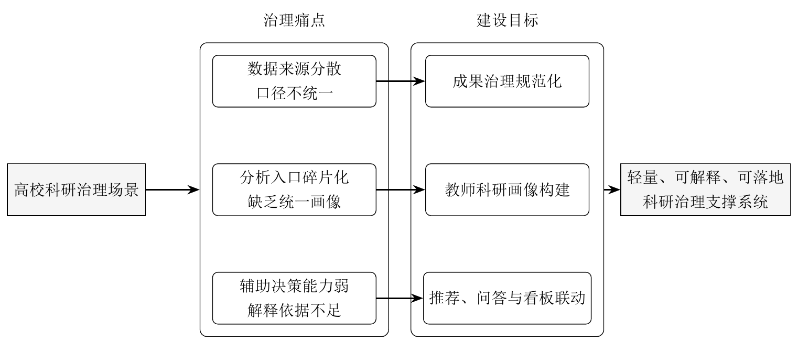

图 1.1 从问题域角度概括了高校教师科研管理中“数据分散、分析不足、服务断裂”的主要矛盾，也说明了本文系统为何需要同时覆盖成果治理、科研画像、推荐辅助与学院看板等能力。与仅关注单一统计口径或单一智能模块的系统相比，本文更强调围绕真实业务主链路组织功能模块，使系统既能够支撑教师个体使用，也能够服务学院管理分析。

## 国内外研究现状

在学者画像与科研评价方面，国内外研究已经围绕论文产出、被引频次、合作网络、研究主题和学术影响力等指标形成了较为系统的分析框架。国内研究中，已有工作基于论文数据构建学者学术状态及竞争力可视化系统，用以支持科研管理与辅助决策[3]。国外研究则较早从专家发现与学术网络挖掘角度出发，探索如何根据文档集合识别领域专家以及如何在组织或学术网络中建模知识能力[4-5]。在科研评价方面，H 指数等指标具有较强代表性[6]，后续研究进一步强调应结合多维证据综合分析科研生产力和学术影响力[7-8]。这些研究为教师科研能力画像提供了理论支撑，本文在此基础上进一步面向校内科研治理场景，将成果治理、能力画像和辅助决策整合为统一业务系统。

在知识图谱领域，相关研究已经围绕知识表示、知识获取、知识融合和知识应用形成了较成熟的研究体系[9]。国内综述进一步从通用图谱、行业图谱和构建方法等角度总结了知识图谱的发展脉络[10-11]。在学术信息服务场景下，知识图谱能够较好地表达教师、论文、关键词、项目和合作学者之间的关系网络，并已被用于学术信息组织与服务[12]。针对学术社交网络的研究也表明，科研关系网络具有较强的结构分析价值[13]。本文将图谱展示与关系统计相结合，用于表达教师、成果、关键词和合作关系之间的结构联系，增强了系统对科研关系的组织和解释能力。

在推荐系统方面，传统的基于内容推荐、协同过滤推荐与混合推荐方法已经发展较为成熟[14]，国内综述也系统总结了推荐技术从传统方法向深度学习方法演进的过程[15]。与此同时，也有综述从更广义的信息过滤视角讨论推荐系统的整体发展[16]。高校项目申报场景与电商或内容平台场景存在显著差异，其重点不是提升点击率，而是围绕教师研究方向、成果基础和指南条件进行规则约束下的可解释匹配。因此，采用规则增强型推荐路径，更符合高校科研管理场景的数据条件与业务需要。

在智能问答方面，问答系统研究已经从专用问答逐步扩展到开放域问答和多模态问答[17]。在开放域问答链路中，稠密检索等技术提升了证据召回能力[18]，而检索增强生成进一步推动了外部知识与生成模型的结合[19]。随着大语言模型快速发展，相关研究也开始系统总结大模型在语言理解、生成和任务适配中的共性能力[20]。本文结合高校科研管理系统的应用特点，完成了面向系统内知识片段的检索组织、模板化回答和模型生成增强方案，使问答结果能够关联教师资料、成果统计、推荐结果和学院看板等真实业务数据。

综上所述，现有研究已经在学者画像、知识图谱、推荐系统与问答系统等方向形成了较为丰富的方法基础。本文在相关研究基础上，以真实业务闭环、结果可解释性和系统工程落地为切入点，围绕教师科研成果治理、画像分析、推荐辅助、关系展示与学院管理统计构建一套可运行、可验证的本科毕业设计系统。系统将多类技术能力整合到同一业务主线中，体现了较强的综合设计与工程实现价值。

| 研究方向     | 典型关注点                         | 与本文系统的关系                       |
|:-------------|:-----------------------------------|:---------------------------------------|
| 学者画像研究 | 标签构建、影响力评价、学术状态分析 | 为教师科研能力画像维度设计提供理论参考 |
| 知识图谱研究 | 实体关系建模、语义组织、图谱服务   | 为学术图谱构建与关系展示提供方法基础   |
| 推荐系统研究 | 个性化匹配、排序、反馈优化         | 为项目指南推荐与推荐解释提供参考       |
| 智能问答研究 | 问题理解、答案生成、检索增强       | 为系统内智能辅助与受控问答提供技术依据 |
| 可视分析研究 | 信息表达、交互分析、决策支持       | 为画像、图谱和看板的可视化表达提供支持 |

相关研究与本文系统定位对比

表 1.1 对相关研究与本文系统定位之间的关系进行了归纳。可以看出，现有研究分别在学者画像、知识图谱、推荐系统、智能问答和可视分析等方向形成了较丰富的方法基础。本文的工作重点是在高校科研治理流程中完成系统化整合，使成果治理、能力画像、关系展示、项目推荐和智能问答能够围绕同一套业务数据协同运行。

## 研究目标与主要内容

本文的总体目标是面向高校教师科研管理与辅助决策场景，设计并实现一套可运行、可验证的教师科研能力数字画像与智能辅助系统。系统围绕教师科研数据完成整合治理、能力分析、关系展示、推荐辅助和学院级宏观统计等任务，并在实现过程中突出结构清晰、结果可解释和功能闭环。

围绕这一目标，本文的主要工作包括以下几个方面：

1.  梳理高校教师科研管理场景中的真实业务链路，明确教师、学院管理员和系统管理员三类角色在资料维护、成果治理、画像查看、推荐分析和统计管理中的职责分工。

2.  设计面向科研成果、项目指南、画像快照、通知消息等对象的数据模型，支持教师科研数据的录入、审核、认领、追踪和后续分析利用。

3.  构建教师科研能力多维画像模型，基于系统内真实成果数据形成六个维度的能力表达，并提供趋势分析、同侪基准与解释说明。

4.  实现规则增强型项目推荐与可信式智能问答功能，使系统能够基于教师成果、画像维度、项目指南和系统内知识片段，为教师和管理员提供可解释的辅助分析结果。

5.  实现学院级科研管理看板与学术图谱展示功能，在个体分析基础上补充宏观统计和关系视角，形成面向高校科研管理的综合系统原型。

## 论文组织结构

本文共分为七章，各章安排如下：第一章为绪论，介绍研究背景、国内外研究现状、研究目标与主要内容；第二章为相关技术综述，介绍前端开发、后端框架、数据存储和智能辅助等支撑技术；第三章为系统分析，从业务需求、功能需求、非功能需求和可行性四个角度对系统进行分析；第四章为系统总体设计，说明系统架构、模块划分、数据库设计和接口规范；第五章为系统实现，重点介绍数据治理、科研画像、推荐问答、看板和关系挖掘等模块的具体实现；第六章为系统测试，给出测试环境、功能测试和性能分析；第七章为总结与展望，总结全文工作并说明系统应用推广价值。

本章从研究背景、国内外研究现状、研究目标和论文组织结构四个方面对课题进行了总体说明，明确了本文以真实系统开发、业务闭环构建和工程验证为核心。下一章将在此基础上对支撑系统实现的相关技术进行综述，为后续系统分析与总体设计提供技术依据。

# 相关技术综述

## 前端开发与可视化技术

本系统前端采用 Vue 3 作为核心框架，使用 Vite 构建开发环境，并结合 TypeScript、Element Plus 与 ECharts 完成业务页面开发。Vue 3 在组件化构建、响应式数据管理和页面逻辑组织方面具有较强优势，适合实现教师个人中心、成果录入中心、科研画像、项目推荐、智能问答和学院看板等多视图协同页面。Vite 启动速度快、热更新效率高，有助于提升系统的开发与维护效率。

Element Plus 为系统提供了表单、表格、标签、弹窗、消息提示等常用业务组件，使前端能够快速构建符合管理系统风格的交互界面。ECharts 则主要用于实现科研画像雷达图、趋势图、成果结构图、院系分布图和学院对比图等可视化模块。可视分析研究表明，图形化表达与交互分析在复杂数据理解和决策支持中具有重要作用[21]。在学术管理场景中，学者竞争力可视化系统的研究也说明了结构化图表和交互页面对科研状态分析具有较强支撑作用[3]。同时，智能数据可视分析研究进一步强调了数据管理、智能交互与可视表达协同发展的趋势[22]。因此，本系统在前端设计中不仅关注页面可用性，也强调通过图表和信息卡片提升教师与管理员对系统结果的理解效率。

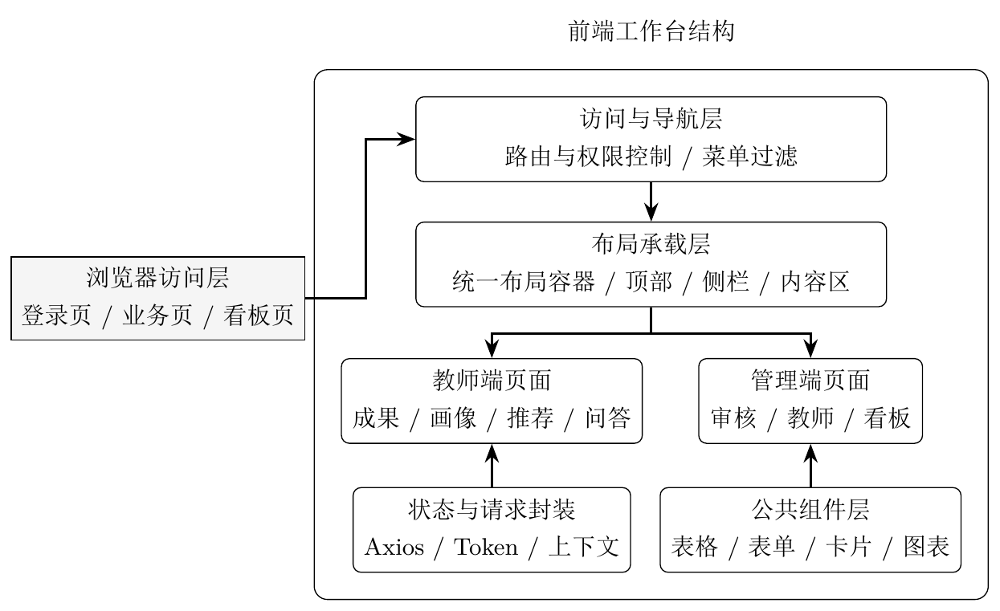

图 2.1 展示了前端工作台的主要组织方式。系统围绕教师资料维护、成果治理、画像分析、推荐辅助和管理统计等高频任务构建统一工作台，使教师端与管理端页面能够围绕业务主线自然衔接，降低用户在不同页面之间切换时的理解成本。

## 后端框架与异步任务

系统后端采用 Django 作为基础开发框架，并使用 Django REST Framework 构建 RESTful API。Django 在模型组织、权限扩展、中间件机制和后台管理方面具备较强的工程适配性，适合构建以教师、成果、项目指南和画像分析为核心对象的业务系统。Django REST Framework 则进一步提供了序列化、认证、参数校验和视图集支持，使接口开发更加规范化。

在认证方式上，系统采用基于 JWT 的身份认证机制，结合前端路由守卫与后端权限校验实现教师与管理员的访问控制。对于错误处理，系统通过统一异常中间件和统一错误结构返回可读提示、错误码和请求编号，以提升系统可维护性和问题定位效率。

系统后端任务设计以业务同步链路、环境检查、演示数据恢复、验证流水线和回归脚本为主要支撑。该设计与当前系统的功能规模相匹配，能够保证部署过程清晰、调试成本可控，并在答辩演示和功能验证中提供稳定的工程保障。

## 多源异构数据存储技术

在系统实现中，数据存储结构属于“多源异构数据组织”。其中，MySQL 作为主数据库，负责存储教师账户、个人档案、论文、项目、知识产权、教学成果、学术服务、项目指南、推荐历史、通知消息和画像快照等结构化业务数据。关系型数据库能够较好满足业务系统对事务一致性、表结构清晰性和字段约束的要求。

在关系扩展层面，系统引入 Neo4j 作为学术图谱增强能力，用于表达教师、论文、关键词和合作学者之间的关系；同时，MySQL 主业务数据也能够支撑关系展示所需的基础数据组织。知识图谱综述指出，图结构表达在关系建模、语义组织和知识服务方面具有天然优势[9-10]；而面向学术信息服务的研究也表明，图谱化组织有助于学者网络和学术资源的结构化服务[12]。本文采用“Neo4j 图谱增强 + MySQL 主链路保障”的组合策略，使关系展示能力与系统稳定性能够同时得到保证。

此外，系统中头像等媒体资源采用本地文件方式存储，用于支撑个人中心与资料展示，使教师资料页面具有更完整的信息呈现能力。

| 存储类型       | 主要技术      | 主要用途                                                   |
|:---------------|:--------------|:-----------------------------------------------------------|
| 结构化业务存储 | MySQL         | 用户、成果、项目指南、推荐历史、通知、画像快照等主业务数据 |
| 图关系增强存储 | Neo4j         | 教师、论文、关键词、合作关系等图谱增强表达                 |
| 媒体文件存储   | 本地文件系统  | 头像上传与资料展示相关资源                                 |

系统数据存储层设计

表 2.1 反映了系统在数据存储层面的总体设计：以 MySQL 承担主业务数据持久化，以 Neo4j 提供关系增强，以本地文件系统支撑媒体资源管理。该组合既满足系统功能完整性，也为图谱展示和应用推广预留了接口。

## 本地化 AI 与大模型应用

智能辅助模块是本系统的重要扩展能力之一。近年来，问答系统研究不断向开放域和多模态方向扩展[17]。在此基础上，稠密检索与检索增强生成为知识密集型任务提供了新的技术思路[18-19]，而大语言模型研究则进一步推动了统一语言生成与任务适配能力的发展[20]。面向高校教师科研管理系统，本文将问答能力与系统内教师资料、成果统计、推荐结果和学院统计等数据相结合，使智能辅助能够服务于真实业务页面和可核验数据来源。

因此，本文系统采取可信式智能辅助设计路线。系统在后端构建围绕教师画像、成果聚合、推荐结果和学院统计的知识片段，并在用户提问时按关键词进行检索与组织。模型服务用于增强检索结果的自然语言表达，规则化回答机制用于保障问答链路稳定可用。系统返回的结果同时包含来源说明、适用范围提示和可回跳页面，确保回答内容能够被真实业务页面核验。

推荐模块结合研究方向、学科信息、成果活跃度、画像优势维度和指南规则配置进行规则增强型匹配。推荐系统相关研究已经形成较为完整的方法谱系[14-15]，本文将其中的内容匹配、反馈信号和解释维度等思想应用到高校项目申报场景中，使推荐结果具有较好的可解释性、可维护性和业务适配性。

本章围绕前端开发、后端框架、数据存储和智能辅助四个方面对系统所依赖的关键技术进行了综述。可以看出，本文选取的技术方案突出成熟、稳定、易维护和便于验证的工程特性。下一章将在这些技术基础上进一步分析系统的业务需求、功能需求与可行性。

# 系统分析

## 业务需求建模

本系统面向的核心业务对象包括教师、学院管理员和系统管理员。教师是科研数据的直接维护者和画像结果的主要使用者，需要维护个人资料、录入科研成果、查看科研画像、获取项目推荐和使用智能问答功能。学院管理员主要面向本学院教师开展教师账户管理、成果审核、学院统计分析和局部项目指南管理。系统管理员则负责全局账户治理、全校范围的学院对比分析以及项目指南的全局维护。

在业务流程层面，系统以成果治理为主入口。教师录入论文、项目、知识产权、教学成果和学术服务后，数据先进入草稿或待审核状态，由管理员完成审核，通过的数据再进入画像计算、图谱展示、推荐匹配和学院统计等链路。对于论文成果，系统还补充了校内合著教师搜索、认领邀请、接受或拒绝处理等协同治理流程。也就是说，成果中心、画像模块、图谱模块、推荐模块和问答模块之间并非彼此孤立，而是围绕教师科研数据形成联动关系。这种从数据治理走向画像分析与管理服务的业务链条，与当前学者竞争力可视化和高校科研评价回归多维证据的研究与政策导向是一致的[2-3]。

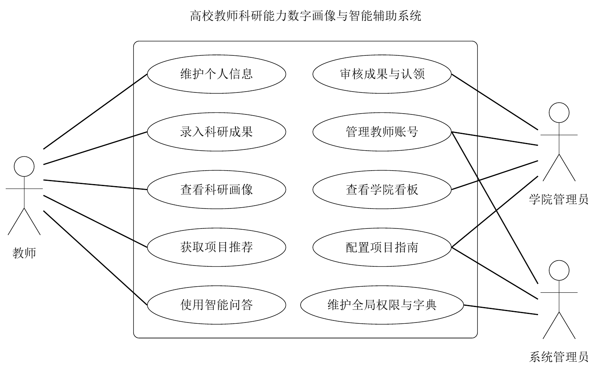

图 3.1 系统业务用例图

图 3.1 采用软件工程设计文档中常见的 UML 用例图表达方式，对教师、学院管理员和系统管理员三类参与者的职责边界进行了统一描述。图中既保留了成果录入、画像查看、推荐与问答等教师侧核心操作，也体现了审核治理、账号维护、看板统计与项目指南配置等管理侧任务，从而说明系统并非若干页面的简单拼接，而是围绕科研治理主链路组织起来的完整业务闭环。

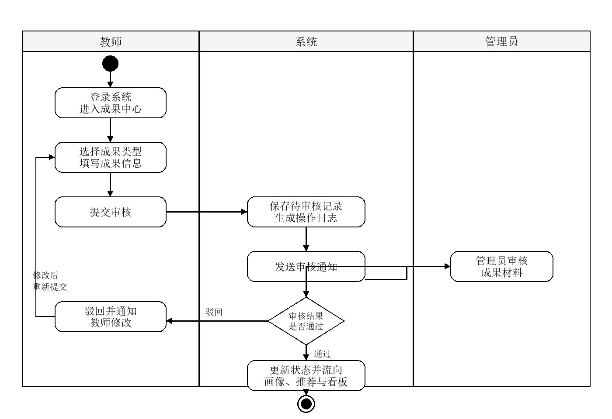

图 3.2 成果治理活动图

图 3.2 采用 UML 活动图描述成果从教师提交到管理员审核再到后续分析利用的状态流转。该流程以教师、系统和管理员三个泳道划分职责边界：教师负责录入与修改，系统负责保存记录、生成日志和发送提醒，管理员负责审核材料；当成果审核通过后，数据进入画像、推荐与学院看板等后续分析口径，若被驳回则返回教师修改后再次提交。该图补充说明了图 3.1 中“成果录入与审核”用例背后的具体业务过程。

## 功能需求分析

结合项目实际实现，系统功能需求可划分为以下几个方面：

-   账户与权限需求：支持工号登录、忘记密码、密码修改、头像上传、教师账户启停、批量账户操作和统一权限控制；系统采用管理员建号为主的账户治理方式，并通过关闭教师自助注册入口保证账号来源统一可管。

-   成果治理需求：支持论文、项目、知识产权、教学成果和学术服务的新增、编辑、删除、审核、导入、认领、通知提醒和统计分析。

-   画像分析需求：支持多维科研能力画像、雷达图展示、趋势分析、成果结构统计和同侪基准对比。

-   关系分析需求：支持教师学术图谱展示、合作关系概览、合作者类型统计和研究主题热点分析。

-   推荐与问答需求：支持规则增强型项目推荐、推荐解释、收藏反馈闭环以及基于系统内知识的受控智能问答。

-   管理分析需求：支持学院级科研统计、趋势对比、教师排行、院系钻取和教师分析。

其中，关系分析需求与学术信息服务领域中基于知识图谱组织学者关系、主题关系和成果关系的思路较为一致[12]；推荐与问答需求则分别吸收推荐系统与智能问答研究中的内容匹配、证据组织和可解释表达思想[15,17]。对于管理分析需求，系统通过可视化方式提高学院管理者对科研结构与趋势的理解效率[21]。

| 功能域   | 主要需求内容                               |
|:---------|:-------------------------------------------|
| 账户管理 | 登录认证、密码修改、账户启停、批量账户治理 |
| 成果管理 | 成果录入、审核、导入、认领、统计与日志跟踪 |
| 科研画像 | 六维画像、趋势分析、结构统计、报告导出     |
| 学术图谱 | 关系网络展示、合作统计、关键词热点分析     |
| 推荐辅助 | 项目指南匹配、推荐解释、收藏反馈、推荐历史 |
| 智能问答 | 系统内知识问答、来源回跳、稳定保障         |
| 学院看板 | 统计总览、排行、趋势、对比、钻取与导出     |

系统核心功能需求

表 3.1 对系统核心功能需求进行了集中整理。总体来看，账户与权限、成果治理、科研画像、学术图谱、推荐问答和学院看板六类需求之间具有明显的前后依赖关系，其中成果治理是后续画像、推荐、问答和统计分析的共同数据基础。

## 非功能需求分析

除功能需求外，系统还需要满足若干非功能需求。第一，系统需要具备良好的安全性，确保教师资料、成果数据和管理信息不会因越权访问而泄露。第二，系统需要具备较好的可解释性，特别是在科研画像、项目推荐和智能问答等功能中，应能够向用户明确说明结果依据和适用范围。第三，系统需要具备可维护性，能够通过统一文档、测试脚本和异常提示机制降低维护难度。第四，系统需要具备可用性，使教师和管理员能够在较低学习成本下完成主要业务操作。上述要求与学术可视分析强调的“可理解、可交互、可追踪”原则具有一致性[21]，也符合当前高校科研评价中强调结果不能脱离真实贡献与可核验依据的导向[2]。

## 可行性分析

从技术可行性来看，本系统所使用的 Vue 3、Django、MySQL、ECharts 和 JWT 等技术均具有成熟生态，且已经在项目中实现稳定运行。Neo4j 图谱增强和智能辅助模块与 MySQL 主业务链路协同工作，使系统既具备关系表达和问答辅助能力，又保持了良好的稳定性。这种“主链路稳定、增强链路协同”的实现方式，也与知识图谱和智能问答在真实系统中逐步扩展的工程化路线相一致[9,17]。

从经济可行性来看，系统主要基于开源技术栈构建，不依赖高成本硬件和商业平台，部署与维护成本可控。对于本科毕业设计项目而言，这种实现方案具有较高现实可行性。

从运行可行性来看，系统已完成教师端和管理员端的主要业务闭环，仓库中还提供了演示数据恢复、启动前检查和验证脚本，有助于保证系统在答辩和演示场景中的稳定运行。

本章从业务需求、功能需求、非功能需求和可行性四个方面对系统进行了分析，明确了系统建设的真实场景、目标任务与落地条件。上述分析说明，本文课题在业务上具有现实需求，在技术上具备实现基础，在工程上具备可演示和可验证性。下一章将在此基础上展开系统总体设计。

# 系统总体设计

## 系统总体架构设计

系统整体采用前后端分离的分层架构，如图 4.1 所示。该架构以教师科研数据治理为主线，将页面展示、接口服务、业务处理、数据存储和智能辅助进行分层组织，从而保证教师端与管理端能够围绕同一套业务数据形成稳定联动。总体上，前端负责页面展示、交互控制和业务编排；接口层负责身份认证、参数校验和统一返回；业务服务层负责成果治理、画像计算、推荐分析、看板统计和图谱协调；数据层负责 MySQL 主存储与 Neo4j 图谱增强；智能辅助层则负责系统内知识片段组织、答案生成和稳定保障。该架构既吸收了可视分析与知识图谱服务中关于多层次信息组织的设计经验，也体现了面向业务落地的工程组织能力[12,21]。

结合当前实现情况，系统架构具有以下几个特点：第一，前端工作台围绕教师个人中心、成果管理、科研画像、项目推荐、智能问答、教师管理和学院看板等页面展开，教师与管理员共享统一视觉风格，并在菜单、路由和数据权限上保持严格区分；第二，接口层统一采用 RESTful 风格，并通过 JWT 完成认证校验；第三，增强链路均具备稳定保障策略，例如图谱支持 Neo4j 图谱增强与 MySQL 主链路协同，问答支持模型组织与规则化回答，推荐结果则始终可回溯到规则命中和业务页面证据；第四，工程层通过统一异常处理中间件、请求编号和验证脚本保证主链路的稳定性与可恢复性。

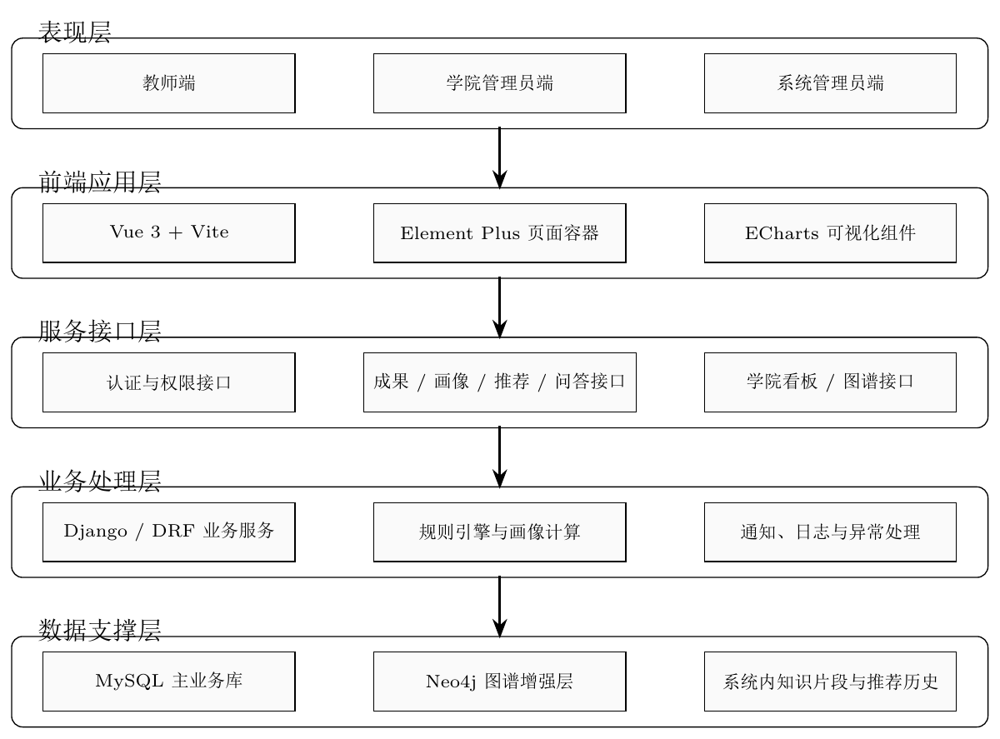

图 4.1 系统总体架构图

| 层次       | 技术选型                                 | 主要作用                     |
|:-----------|:-----------------------------------------|:-----------------------------|
| 前端       | Vue 3、Vite、Element Plus、ECharts       | 页面构建、交互实现、图表展示 |
| 后端       | Django、Django REST Framework            | 业务接口、权限控制、数据服务 |
| 认证       | JWT                                      | 登录认证与接口身份校验       |
| 数据库     | MySQL                                    | 主业务数据存储               |
| 图关系增强 | Neo4j                                   | 学术图谱增强展示             |
| 智能辅助   | 规则引擎 + 系统内知识问答 + 模型增强生成 | 推荐与问答辅助               |

表 4.1 系统主要技术栈

表 4.1 给出了系统的主要技术栈。在此基础上，为了进一步明确分层职责，表 4.2 对系统各层的边界进行了归纳。该设计方式能够将教师科研画像系统从“功能堆叠”转化为“职责清晰”的工程结构，便于后续扩展与维护。

| 分层   | 主要组成                                         | 职责说明                                                 |
|:-------|:-------------------------------------------------|:---------------------------------------------------------|
| 展示层 | Vue 页面、路由守卫、图表组件                     | 负责登录、表单交互、图表展示、页面权限收口和用户操作反馈 |
| 接口层 | DRF 视图、序列化器、JWT 认证                     | 负责请求接收、参数校验、身份认证、统一返回和分页处理     |
| 业务层 | 成果服务、画像分析、推荐服务、问答服务、看板分析 | 负责核心业务计算、状态流转、统计聚合和增强链路协调       |
| 数据层 | MySQL、Neo4j、本地媒体文件                       | 负责结构化数据存储、图关系增强、头像等资源持久化         |
| 保障层 | 异常处理中间件、请求编号、验证脚本、恢复脚本     | 负责统一错误治理、环境检查、演示恢复和主链路验证         |

表 4.2 系统分层职责说明

## 功能模块设计

系统在功能上可划分为认证与账户、教师个人中心、成果管理中心、教师科研画像、学术图谱、项目推荐与指南管理、学院级科研看板、智能问答辅助和工程化支撑九个模块。各模块围绕教师科研数据形成协同关系，其中成果中心是主数据入口，画像模块是核心分析模块，推荐、图谱、问答和学院看板则作为扩展分析与辅助决策能力。

从数据流转逻辑看，教师首先通过登录页进入系统，在个人中心维护基础资料与研究方向；随后在成果管理中心录入论文、项目、知识产权、教学成果和学术服务数据。通过审核的数据一方面进入画像引擎形成六维科研能力表达，另一方面也作为推荐、图谱与学院统计的共同基础。管理员则在教师管理、成果审核、项目指南维护和学院看板中完成治理与分析工作。由此可见，系统虽然包含多个功能页面，但本质上仍围绕“资料维护—成果治理—画像分析—智能辅助—宏观统计”这一统一业务主线运行。

如图 4.2 所示，系统模块之间并非并列割裂，而是存在清晰的依赖关系。成果管理中心与教师基础资料共同决定画像计算的输入口径；画像结果又反向参与项目推荐与问答回答组织；推荐反馈、问答来源卡片、图谱分析和学院看板统计则进一步为教师与管理员提供解释和决策支持。这种“画像—推荐—问答—看板”的联动设计，与学者画像可视化、推荐系统解释化以及知识图谱服务化的发展方向相呼应[3,12,15]。

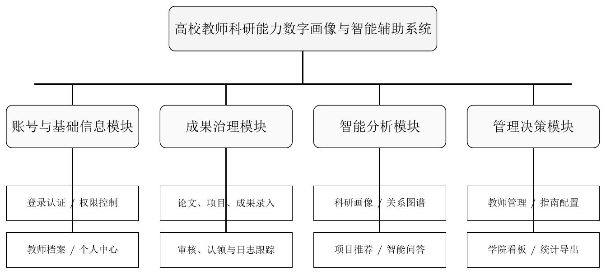

图 4.2 系统功能模块结构图

| 模块名称       | 主要输入                                 | 主要输出                               |
|:---------------|:-----------------------------------------|:---------------------------------------|
| 认证与账户模块 | 工号、密码、角色信息                     | 登录态、权限范围、当前用户信息         |
| 成果管理模块   | 教师资料、成果表单、BibTeX 文件          | 待审核或已通过成果、日志记录、认领邀请 |
| 科研画像模块   | 已通过成果、教师基础资料、历史快照       | 六维画像、趋势分析、同侪基准、导出报告 |
| 项目推荐模块   | 研究方向、论文关键词、画像结果、指南规则 | 推荐列表、推荐理由、反馈记录、历史快照 |
| 智能问答模块   | 教师资料、成果统计、推荐结果、学院统计   | 可信回答、来源卡片、适用范围说明       |
| 学术图谱模块   | 教师关系数据、论文关键词、图谱配置       | 关系网络、主题热点、合作圈层分析       |
| 学院看板模块   | 学院范围内已通过成果、教师信息           | 总览统计、趋势、排行、钻取与导出结果   |

表 4.3 核心功能模块与数据依赖关系

表 4.3 说明了各模块并不是相互独立的页面集合，而是围绕统一数据底座形成输入、处理和输出的连续链路。这种依赖关系设计有助于减少重复计算和重复维护，也使教师科研画像、项目推荐、智能问答和学院看板能够共享同一套可信业务口径。

## 数据库设计

数据库设计围绕用户、成果、分析、推荐和通知五类对象展开。设计过程中主要遵循以下原则：第一，保证业务主对象职责清晰，将教师账户、教师扩展档案和多类型成果拆分建模；第二，保证状态可追踪，重要对象保留状态字段、时间字段和必要日志表；第三，保证分析链路可扩展，画像快照、推荐历史和通知消息均采用独立实体存储，使主业务数据与分析数据各司其职；第四，保证增强链路与主数据链路协同，图谱增强在不破坏 MySQL 主业务结构的基础上提升关系表达能力。

结合当前实现，用户层包含自定义用户表、通知表与教师基础档案；成果层包含论文、项目、知识产权、教学成果和学术服务五类成果实体，并进一步扩展合作作者、论文关键词、成果认领、成果操作日志和论文专用操作日志等关系对象；分析层包含画像快照等对象；推荐层包含项目指南、学院实体、收藏记录和推荐历史快照；通知层则用于承载项目推送、成果认领提醒与密码重置申请等消息。该设计兼顾了关系型数据库的稳定性和知识图谱增强时对实体关系组织的需求[10,12]。

如图 4.3 所示，数据库设计以用户主表作为教师与管理员的统一入口，以教师扩展档案表承载学科、研究兴趣等补充资料。各类成果对象通过外键与教师账户建立关联，历史年份画像结果由快照表固化，推荐历史与反馈信息由独立记录表沉淀，跨模块消息则由通知表统一承载。该结构既能够支撑当前论文实现范围，也为后续扩展提供了空间。

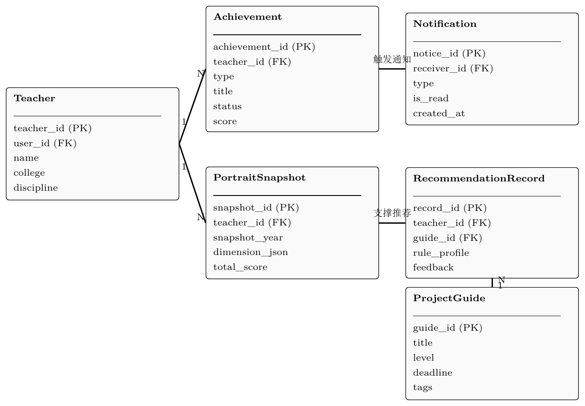

图 4.3 系统数据库 E-R 图

参考三篇本科毕业设计论文中的数据库逻辑结构写法，本文在 E-R 图之后列出主要数据表的字段设计。表格采用“字段名、主外键、数据类型、是否允许空、字段说明”的格式，既便于说明数据库约束，也便于和后端 Django 模型保持对应。

| 字段名 | 主外键 | 数据类型 | 是否允许空 | 字段说明 |
|:--|:--|:--|:--|:--|
| id | 主键 | bigint | 否 | 用户编号 |
| username | 否 | varchar(150) | 否 | 工号或登录账号 |
| password | 否 | varchar(128) | 否 | 加密后的登录密码 |
| real_name | 否 | varchar(50) | 否 | 教师或管理员真实姓名 |
| title | 否 | varchar(50) | 是 | 职称信息 |
| department | 否 | varchar(100) | 是 | 所属学院或院系 |
| research_direction | 否 | json | 是 | 研究方向标签 |
| is_staff | 否 | boolean | 否 | 是否具备后台管理身份 |
| is_active | 否 | boolean | 否 | 账号是否启用 |
| password_reset_required | 否 | boolean | 否 | 是否需要登录后修改密码 |

表 4.4 用户信息表

| 字段名 | 主外键 | 数据类型 | 是否允许空 | 字段说明 |
|:--|:--|:--|:--|:--|
| id | 主键 | bigint | 否 | 论文成果编号 |
| teacher_id | 外键 | bigint | 否 | 关联教师账号 |
| title | 否 | varchar(300) | 否 | 论文题名 |
| paper_type | 否 | varchar(20) | 否 | 论文类型 |
| journal_name | 否 | varchar(300) | 否 | 期刊或会议名称 |
| journal_level | 否 | varchar(50) | 是 | 期刊级别或收录信息 |
| doi | 否 | varchar(200) | 是 | DOI 标识 |
| date_acquired | 否 | date | 否 | 发表时间 |
| status | 否 | varchar(20) | 否 | 审核状态 |
| is_first_author | 否 | boolean | 否 | 是否第一作者 |
| is_corresponding_author | 否 | boolean | 否 | 是否通讯作者 |

表 4.5 论文成果表

| 字段名 | 主外键 | 数据类型 | 是否允许空 | 字段说明 |
|:--|:--|:--|:--|:--|
| id | 主键 | bigint | 否 | 规则化成果编号 |
| teacher_id | 外键 | bigint | 否 | 关联教师账号 |
| version_id | 外键 | bigint | 否 | 关联评价规则版本 |
| category_id | 外键 | bigint | 否 | 关联规则分类 |
| rule_item_id | 外键 | bigint | 否 | 关联规则条目 |
| title | 否 | varchar(300) | 否 | 成果名称 |
| external_reference | 否 | varchar(200) | 是 | 批文号、登记号或外部编号 |
| date_acquired | 否 | date | 否 | 成果取得时间 |
| status | 否 | varchar(20) | 否 | 审核状态 |
| amount_value | 否 | decimal(14,2) | 是 | 计分金额或数量 |
| final_score | 否 | decimal(12,2) | 否 | 审核后生效积分 |
| factual_payload | 否 | json | 是 | 扩展事实字段 |
| reviewed_by_id | 外键 | bigint | 是 | 审核人账号 |

表 4.6 规则化成果表

| 字段名 | 主外键 | 数据类型 | 是否允许空 | 字段说明 |
|:--|:--|:--|:--|:--|
| id | 主键 | bigint | 否 | 项目指南编号 |
| title | 否 | varchar(300) | 否 | 指南标题 |
| issuing_agency | 否 | varchar(200) | 否 | 发布单位 |
| guide_level | 否 | varchar(20) | 否 | 指南级别 |
| status | 否 | varchar(20) | 否 | 指南状态 |
| scope | 否 | varchar(20) | 否 | 发布范围 |
| academy_id | 外键 | bigint | 是 | 归属学院 |
| application_deadline | 否 | date | 是 | 申报截止时间 |
| target_keywords | 否 | json | 是 | 目标关键词 |
| target_disciplines | 否 | json | 是 | 面向学科或方向 |
| rule_profile | 否 | varchar(20) | 否 | 推荐规则档位 |
| rule_config | 否 | json | 是 | 规则细化配置 |

表 4.7 项目指南表

| 字段名 | 主外键 | 数据类型 | 是否允许空 | 字段说明 |
|:--|:--|:--|:--|:--|
| id | 主键 | bigint | 否 | 推荐历史编号 |
| teacher_id | 外键 | bigint | 否 | 被推荐教师 |
| requested_by_id | 外键 | bigint | 是 | 触发推荐账号 |
| guide_id | 外键 | bigint | 是 | 关联项目指南 |
| batch_token | 否 | varchar(36) | 否 | 推荐批次标识 |
| recommendation_score | 否 | int | 否 | 推荐得分 |
| priority_label | 否 | varchar(20) | 是 | 关注等级 |
| recommendation_reasons | 否 | json | 是 | 推荐理由快照 |
| matched_keywords | 否 | json | 是 | 命中关键词快照 |
| feedback_signal | 否 | varchar(20) | 是 | 教师反馈信号 |
| generated_at | 否 | datetime | 否 | 推荐生成时间 |

表 4.8 项目推荐历史表

| 数据对象 | 关键字段示例 | 主要用途 |
|:--|:--|:--|
| CustomUser | username, is_staff, department | 存储教师、学院管理员和系统管理员账号基础信息 |
| TeacherProfile | discipline, research_interests | 存储教师扩展档案，服务画像、推荐和问答 |
| Paper | title, doi, status, teacher_id | 存储论文成果及其审核状态、元数据和署名信息 |
| Project | title, level, funding_amount, status | 存储科研项目成果与经费信息 |
| AchievementClaim | status, target_user, confirmation_note | 支撑校内合著成果认领与署名修正 |
| PortraitSnapshot | user, year, dimension_scores | 存储历史年份画像快照结果 |
| ProjectGuide | title, rule_profile, status | 存储项目指南与推荐规则配置 |
| ProjectGuideRecommendationRecord | score, feedback_signal | 存储推荐结果快照、理由和反馈信号 |
| UserNotification | category, is_read, action_path | 存储认领提醒、推送通知和密码处理提示 |

表 4.9 核心数据对象说明

表 4.4 至表 4.8 说明了系统主要数据库表的字段结构，表 4.9 则从业务对象角度汇总了支撑系统主链路运行的核心数据对象。从表结构组织可以看出，系统将“用户与权限”“成果与治理”“分析与推荐”“通知与反馈”拆分为相对独立但可关联的对象，既满足当前功能实现需要，也为后续功能扩展保留了清晰的数据边界。

| 对象类型 | 状态值 | 设计说明 |
|:--|:--|:--|
| 成果对象 | DRAFT, PENDING_REVIEW, APPROVED, REJECTED | 支撑成果草稿、提交审核、通过和驳回的基本流转 |
| 认领对象 | PENDING, ACCEPTED, REJECTED, CONFLICT | 支撑合著认领、拒绝和署名冲突修正 |

表 4.10 系统关键状态字段设计

表 4.10 所示的状态字段设计，使成果审核、认领处理和消息通知都具备了明确的生命周期表达。对于管理型系统而言，统一的状态建模能够提高流程可读性和维护效率，这也是本文在总体设计阶段强调“过程可追踪、状态可治理”的原因。

## 系统接口规范设计

系统接口采用 RESTful 风格设计，统一返回 JSON 数据。登录认证、当前用户、成果资源、科研画像、学术图谱、项目推荐、智能问答和学院统计分别通过相对独立的路径对外提供服务。接口层设计强调统一身份认证、统一权限入口和统一错误结构。对于权限不足、对象不存在和参数错误等情况，系统优先返回结构化错误消息和下一步提示，以提升前后端协同与问题定位效率。

在认证方式上，系统以后端 JWT 认证为主，前端结合路由守卫和会话信息完成登录态保持。对于需要登录的接口，请求头统一携带 `Authorization` 字段和 `Bearer` 令牌；对于当前用户、教师画像、推荐和管理员统计等接口，后端进一步根据 `role_code` 和权限范围校验可访问的教师或学院数据。接口返回值以“业务数据 + 元数据 + 错误信息”三类内容组织，在成功情况下返回结构化数据，在失败情况下返回统一错误对象、请求编号和下一步建议。这种接口组织方式有助于提高系统内知识问答、推荐解释和统计分析的可调用性与可追踪性[15,17]。

为降低前后端联调复杂度，系统在分页、排序和筛选上也尽量采用一致口径。列表接口优先使用查询参数控制关键字、状态、页码与时间范围；管理员视图额外支持按学院、教师和年份切换统计范围。对于增强链路，如图谱、推荐和问答接口，系统通过可识别的稳定保障字段和说明文本返回基础结果，从而保证主业务流程连续可用。

| 接口类别 | 典型路径示例 | 主要用途 |
|:--|:--|:--|
| 认证接口 | /api/token/ | 登录、密码处理和认证令牌获取 |
| 当前用户接口 | /api/users/me/ | 获取当前用户资料并支持安全信息维护 |
| 成果接口 | /api/achievements/papers/ | 成果新增、编辑、审核、认领和统计 |
| 画像接口 | /api/achievements/dashboard-stats/ | 返回雷达图、趋势、基准和报告数据 |
| 推荐接口 | /api/project-guides/recommendations/ | 返回推荐列表、理由、反馈和历史快照 |
| 问答接口 | /api/ai-assistant/portrait-qa/ | 返回可信式画像问答结果、来源卡片和适用范围说明 |
| 看板接口 | /api/achievements/academy-overview/ | 返回学院级统计、排行、钻取与导出数据 |
| 图谱接口 | /api/graph/topology/{user_id}/ | 返回学术图谱节点、边和轻量分析结果 |

表 4.11 主要接口分类说明

表 4.11 体现了系统接口按业务域进行组织的设计思路。该方式有利于前后端联调时快速定位功能边界，也便于在不影响主链路的前提下对图谱、推荐和问答等增强模块进行独立维护。

| 字段名 | 示例 | 说明 |
|:--|:--|:--|
| detail | 当前账号没有权限执行此操作 | 面向用户的简要错误提示 |
| request_id | abc123def456 | 用于定位请求链路和日志 |
| error.code | permission_denied | 错误类型标识，便于前后端统一处理 |
| error.status | 403 | HTTP 状态码对应信息 |
| error.recoverable | true | 标识该错误是否可恢复 |
| error.next_step | 请确认当前身份权限或切换账号后重试 | 指导用户后续操作的提示信息 |

表 4.12 统一错误结构说明

表 4.12 说明系统在错误处理层面不仅返回状态码，还补充可恢复性提示和下一步建议。这种统一错误结构既有助于前端做出一致反馈，也有助于在演示和答辩环境中快速定位异常来源。

综上，本章围绕系统总体架构、功能模块、数据库组织和接口规范完成了从需求到设计的系统化展开，明确了各层职责与数据边界。上述设计结果为下一章的模块实现提供了稳定而可落地的结构基础。

# 系统实现

系统实现阶段不仅需要说明各功能页面的业务效果，还需要说明关键功能在前端、后端、数据库和权限控制之间的协作过程。参考同类本科毕业设计论文的写法，本章在每个主要功能域中补充相应的 UML 活动图、时序图或数据流图，用于表达模块内部处理过程，而系统运行界面截图则仍由真实系统页面截取后插入。

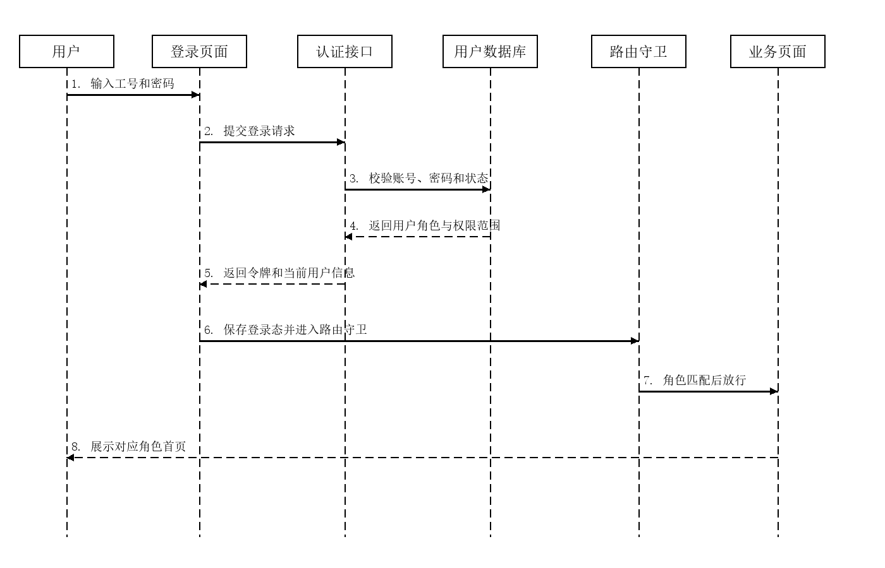

图 5.1 登录认证与权限校验时序图

图 5.1 描述用户从登录页面进入系统业务页面的认证过程。用户提交工号和密码后，认证接口校验账号、密码和启用状态，并返回令牌、角色信息和权限范围；前端保存登录态后进入路由守卫，由路由守卫根据教师、学院管理员或系统管理员角色决定是否放行到对应业务页面。该图说明系统登录认证并非单纯页面跳转，而是由认证接口、用户数据库、前端路由守卫和业务页面共同完成的权限闭环。

## 数据治理与特征提取模块实现

数据治理模块以成果管理中心为核心。系统支持论文、项目、知识产权、教学成果和学术服务五类成果的统一录入与维护，并针对论文成果实现了更细粒度的字段组织，包括摘要、DOI、卷期页、引用次数、合作作者、作者位次和通讯作者标记等。为了提高论文录入效率，系统实现了 BibTeX 文件解析、预览校验和确认导入机制，使教师能够在确认字段映射结果后将文献信息批量导入系统。该模块强调结果真实、口径可核验的设计思路，也与当前高校科研评价中反对单一指标化、强调真实贡献证据的政策导向相吻合[2]。系统运行界面截图将由实际启动后的前端页面截取并插入，不以绘制的示意图替代真实运行截图。

从实际代码实现看，各类成果在教师提交后通常先进入 `PENDING_REVIEW` 状态，管理员可在审核入口执行通过或驳回操作；当教师对已通过或已驳回成果再次修改时，系统会将记录重新置回待审核状态，以保持成果口径的一致性。与此同时，系统为成果维护过程记录操作日志与字段快照，用于在列表查看、管理员复核和异常追踪时提供依据。该设计表明，本系统虽然不是复杂流程平台，但已经实现了面向科研成果治理的基本审核闭环。

针对校内合著场景，系统在论文录入时支持本校教师搜索与成果认领邀请机制。若录入者在合作作者中关联到本校教师，系统可自动生成认领记录并向目标教师发送通知，目标教师可在个人中心中对认领进行确认或拒绝；若被认领教师认为作者位次或通讯作者信息存在偏差，还可以在接受时修正署名信息并形成冲突标记。这一机制有助于减少同一成果在校内重复录入带来的数据不一致问题。

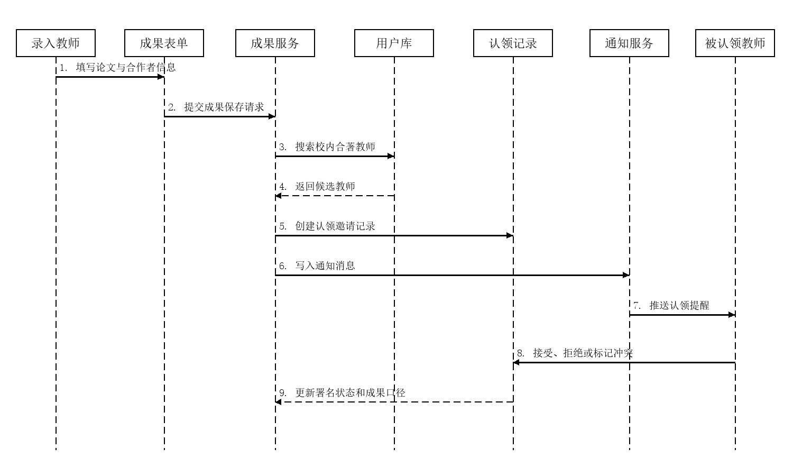

图 5.2 成果认领协同时序图

图 5.2 描述论文成果中校内合著者认领的协同过程。录入教师在成果表单中填写论文和合作者信息后，成果服务会搜索校内教师账号并创建认领邀请记录，同时通过通知服务向被认领教师发送提醒；被认领教师可选择接受、拒绝或标记署名冲突，系统再回写认领记录和成果署名口径。该图补充了成果治理中“认领协同”这一功能细节，使成果管理模块不只停留在录入和审核两个动作上。

除单条录入外，系统还实现了教师账户的 CSV/XLSX 批量导入、成果概览统计、待认领提醒等工程能力。其中，成果统计与画像、推荐、图谱、学院看板等后续模块共用同一批审核通过数据，因而数据治理模块既是录入入口，也是后续分析能力的基础支撑。

如图 5.3 所示，成果治理模块可以抽象为一条清晰的数据流：教师与管理员分别从录入、审核两个外部入口参与业务；成果库、教师画像基线库以及项目指南与知识片段库共同构成后续分析的核心数据来源；经过治理的数据再流向画像、推荐、问答和学院看板等服务模块。这种“先治理、后分析、再反馈”的链路保证了系统输出始终建立在可核验、可追踪的数据基础上，更符合软件工程说明文档对数据边界与处理过程的表达要求。

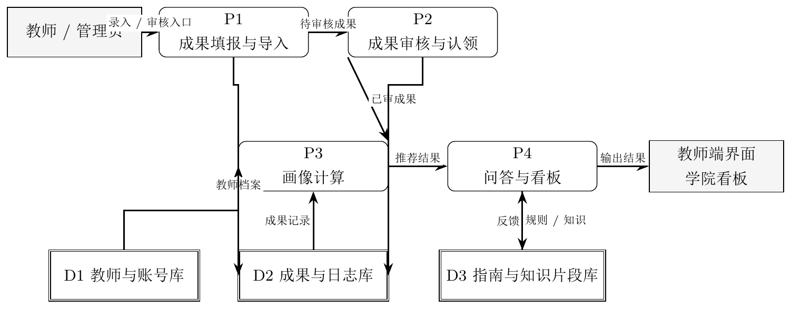

图 5.3 成果治理数据流图

| 环节        | 主要处理对象           | 实现说明                                   |
|:------------|:-----------------------|:-------------------------------------------|
| 录入与编辑  | 五类成果对象           | 支持教师新增、编辑、查询与删除本人成果     |
| BibTeX 导入 | 论文成果               | 支持预览、复核后确认导入，减少手工录入成本 |
| 审核流转    | 论文、项目等成果       | 采用待审核、通过、驳回等状态控制分析口径   |
| 认领协同    | 论文成果与校内合著者   | 支持邀请、接受、拒绝和署名修正             |
| 日志记录    | 成果变更过程           | 记录摘要、字段快照与变更来源，便于追踪     |
| 消息通知    | 认领、重置密码、提醒等 | 统一通过通知表传递跨模块提示信息           |

表 5.1 成果治理关键环节说明

表 5.1 对数据治理模块中的关键环节进行了归纳。由此可见，本系统的数据治理并非停留在“可录入”的层面，而是形成了录入、审核、认领、追踪和通知相互衔接的闭环结构，为后续画像、推荐和统计分析提供了可信数据基础。

## 多维立体画像模块实现

教师科研画像模块基于系统内已审核成果数据构建六维科研能力表达，六个维度分别为基础学术产出、经费与项目攻关、知识产权沉淀、人才培养成效、学术活跃与声誉以及跨学科融合度。系统首先统计教师在论文数量、总被引次数、项目数量、累计经费、知识产权数量、成果转化数量、教学成果数量、学术服务数量、关键词数量和合作作者数量等指标上的表现，再依据预设公式计算各维度得分，并按固定权重求得综合得分。

为增强结果可解释性，系统在返回雷达图数据的同时，还提供维度解释、权重说明、证据标签和趋势分析结果。对于历史年份，系统支持画像快照持久化，以便后续进行跨年趋势比较；对于当前年份，则采用实时聚合方式反映最新成果对画像结果的影响。教师可在个人中心完善研究方向、学科和研究兴趣后进入画像页查看结果，最终论文中的相关页面截图应取自系统真实运行界面。

从评分引擎的具体实现看，系统采用固定权重加权求和方式计算综合分值，对应后端中的 `fixed_weights_runtime_aggregation` 口径。其中，基础学术产出、经费与项目攻关、知识产权沉淀、人才培养成效、学术活跃与声誉、跨学科融合度的权重分别为 24%、20%、16%、14%、14% 和 12%。六个维度并非凭空命名，而是围绕教师科研成果管理中最易核验的业务证据进行组织：基础学术产出强调论文数量与被引表现，经费与项目攻关强调项目数量与累计经费，知识产权沉淀强调知识产权数量与转化情况，人才培养成效强调教学成果与协同论文，学术活跃与声誉强调学术服务、合作作者与引用表现，跨学科融合度则强调关键词覆盖与项目参与情况。相关研究指出，科研评价不宜被单一指标完全代表，而应从生产力、影响力和多维表现等角度综合把握[6-8]，这也是本系统采用多维画像而非单指标排名的主要依据。

表 5.2 中的权重和公式属于本系统的业务型画像权重，其目的在于形成稳定、可解释、可实时返回的分析视图，用于支撑教师科研能力结构观察和辅助决策。画像数据口径以审核通过的成果为主；对于校内合著认领成功或存在署名冲突但已确认的论文，系统也会纳入教师相关成果集合中参与画像计算。历史年份优先读取已落库快照，对应后端中的 `portrait-snapshot-v1`；若快照缺失，则由后端按历史年份回溯计算并立即固化。当前年份保持运行时聚合视图，对应 `portrait-runtime-v1`，用于反映新增成果带来的即时变化。该设计兼顾了历史稳定性与当前可观察性，能够支撑教师画像的持续更新。

在具体实现中，画像引擎先汇总论文、项目、知识产权、教学成果和学术服务的指标，再依据固定公式计算六维得分，最后生成雷达图、阶段对比、趋势分析和同侪基准。表 5.2 对当前权重与公式口径进行了概括，表 5.3 对六个维度进行了进一步说明，表 5.4 则给出了“指标—维度”映射关系，用于说明真实业务数据是如何折算为教师科研画像的。

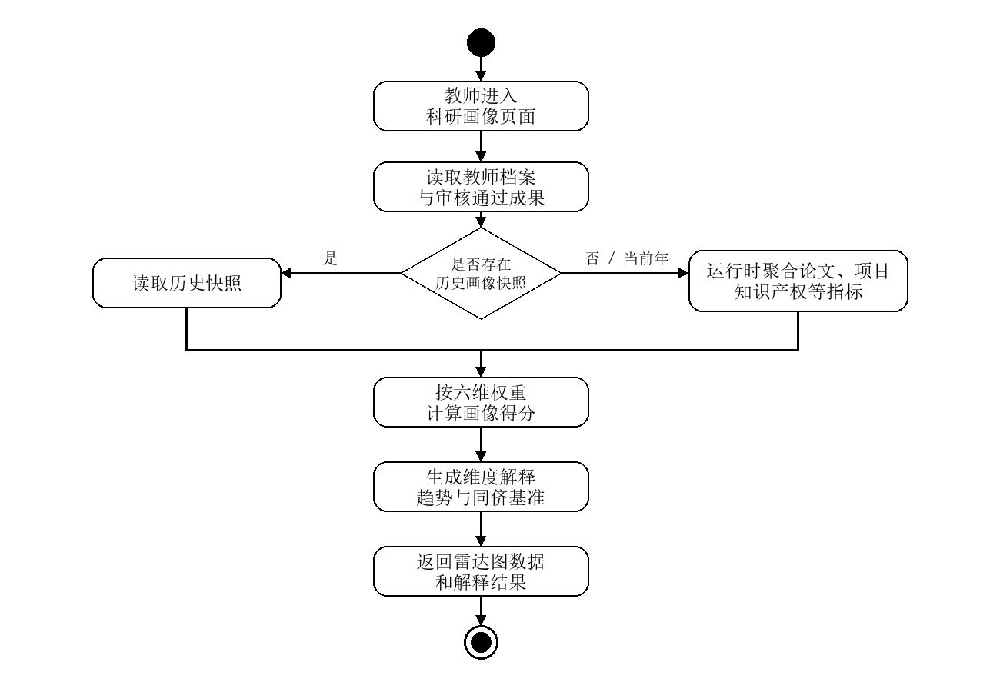

图 5.4 科研画像生成活动图

图 5.4 采用 UML 活动图描述教师查看科研画像时的核心处理过程。系统首先读取教师档案和审核通过成果，再根据是否存在历史画像快照选择不同路径：历史年份优先读取已固化快照，当前年份或快照缺失时则运行时聚合论文、项目、知识产权、教学成果和学术服务等指标。随后画像引擎按照六维权重计算得分，并生成维度解释、趋势分析和同侪基准结果。该图对应参考论文中常见的“某一功能模块活动图”写法，用于补充说明画像模块的内部处理逻辑。

| 维度名称 | 权重 | 核心公式 | 说明 |
|:--|:--|:--|:--|
| 基础学术产出 | 24% | 论文数×12 + 引用数×0.6，封顶100 | 强调近期可观测、可核验的学术产出表现 |
| 经费与项目攻关 | 20% | 项目数×18 + 经费折算，封顶100 | 强调资源获取与项目组织能力 |
| 知识产权沉淀 | 16% | 知识产权数×20 + 转化数×18，封顶100 | 强调成果沉淀与转化情况 |
| 人才培养成效 | 14% | 教学成果数×24 + 论文数×2，封顶100 | 强调育人成果与科研协同 |
| 学术活跃与声誉 | 14% | 学术服务、合作作者与引用折算，封顶100 | 强调学术共同体参与度与影响力 |
| 跨学科融合度 | 12% | 关键词数×3 + 项目数×6，封顶100 | 强调研究主题覆盖和交叉协同能力 |

表 5.2 六维画像权重与计算依据

| 维度名称       | 主要依据                             |
|:---------------|:-------------------------------------|
| 基础学术产出   | 论文数量、总被引次数                 |
| 经费与项目攻关 | 项目数量、累计经费                   |
| 知识产权沉淀   | 知识产权数量、成果转化情况           |
| 人才培养成效   | 教学成果数量、协同论文表现           |
| 学术活跃与声誉 | 学术服务数量、合作作者数量、引用表现 |
| 跨学科融合度   | 论文关键词覆盖、项目参与情况         |

表 5.3 教师科研能力画像维度说明

| 业务指标                             | 对应维度       | 折算说明                             |
|:-------------------------------------|:---------------|:-------------------------------------|
| 论文数量、总被引次数                 | 基础学术产出   | 反映教师可观测的学术产出强度         |
| 项目数量、累计经费                   | 经费与项目攻关 | 反映科研组织、资源获取与项目执行能力 |
| 知识产权数量、转化数量               | 知识产权沉淀   | 反映科研成果沉淀与应用转化情况       |
| 教学成果数量、论文协同情况           | 人才培养成效   | 反映育人投入与科研协同关系           |
| 学术服务数量、合作作者数量、引用表现 | 学术活跃与声誉 | 反映学术共同体参与度与影响力         |
| 关键词数量、项目参与情况             | 跨学科融合度   | 反映研究主题覆盖范围与交叉融合特征   |

表 5.4 画像指标与维度映射关系

表 5.3 与表 5.4 共同说明了画像模块的可解释性来源，即每一类画像结果都能够回溯到具体业务指标和折算关系。这种“指标可追溯、维度可说明、结果可比较”的组织方式，使教师科研画像不仅具有可视化展示价值，也具备实际管理分析意义。

## 智能辅助与主动推荐模块实现

项目推荐模块建立在项目指南管理和教师画像分析的基础之上。管理员可维护指南标题、发布单位、状态、级别、推荐标签、目标关键词、目标学科、资助强度、适用范围和截止时间等信息。系统当前支持 `BALANCED`、`KEYWORD_FIRST`、`DISCIPLINE_FIRST`、`WINDOW_FIRST`、`ACTIVITY_FIRST`、`PORTRAIT_FIRST` 和 `FOUNDATION_FIRST` 七类规则档位，并允许在默认配置之上附加轻量规则参数。教师访问推荐模块时，系统会基于研究方向、学科院系、近三年成果活跃度、画像优势维度和指南规则配置生成推荐分值，并输出推荐理由、命中标签、优先级和支撑记录。推荐页与问答辅助面板属于系统运行截图内容，后续应由实际访问页面截取后插入。

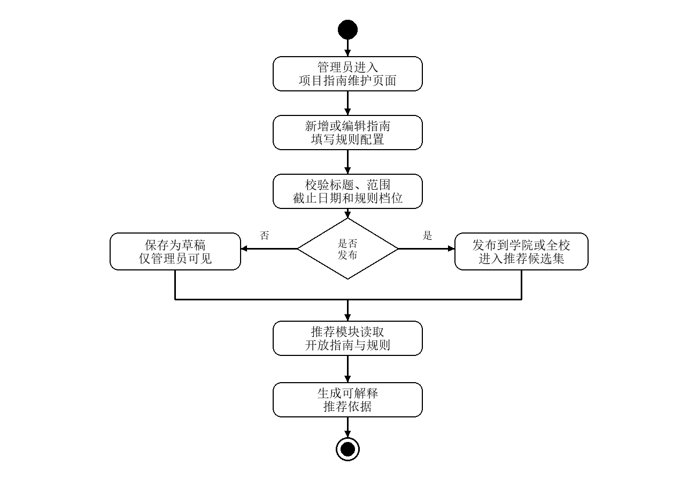

图 5.5 项目指南维护活动图

图 5.5 说明管理员维护项目指南时的主要活动过程。管理员进入项目指南维护页面后，可新增或编辑指南，并配置发布范围、截止日期、目标关键词、目标学科和推荐规则档位；系统对关键字段进行校验后，可将指南保存为草稿，也可发布到学院或全校范围。发布后的指南进入推荐候选集，供推荐模块在生成项目匹配结果时读取。该图补充了推荐功能前置的指南维护流程，避免仅从教师查看推荐的角度描述项目推荐模块。

项目推荐模块完成了从教师特征构建到项目指南匹配、推荐理由生成和反馈记录保存的完整链路。后端会先构建教师特征包，特征来源包括研究方向、研究兴趣、学科院系标签、论文关键词、近三年成果活跃度以及画像优势维度，再结合项目指南的关键词、目标学科、申报窗口、资助信息和规则档位计算推荐分数。其中特征包中的“近三年活跃度”来源于近三年论文、项目、知识产权、教学成果和学术服务的累计数量，画像联动部分则读取当前教师画像总分及前三个优势维度。命中结果除推荐分外，还会同步生成推荐理由、解释维度、推荐标签、关键词命中、学科命中以及支撑记录，用于说明推荐结果的来源。系统同时保存推荐历史快照，并支持收藏、感兴趣、暂不相关、计划申报、已申报等反馈信号，为教师申报决策和管理员后续服务提供依据。这样既吸收了推荐系统研究中关于内容匹配、反馈信号和解释维度的思路，也使推荐过程更符合高校项目申报的业务特点[14-15]。

从推荐链路看，系统先构建教师特征包，再按照关键词匹配、学科匹配、活跃度支撑、申报窗口友好度、资助信息明确度和画像联动等因素累计推荐分值，并为每个指南生成解释维度、推荐标签和支撑记录。对于暂未命中高相关特征的情况，系统会返回空状态提示和解释说明，保证推荐结果与教师实际成果基础保持一致。对于管理员用户，推荐模块还支持比较两位教师在同一指南下的规则得分差异，以辅助进行项目申报服务分析。

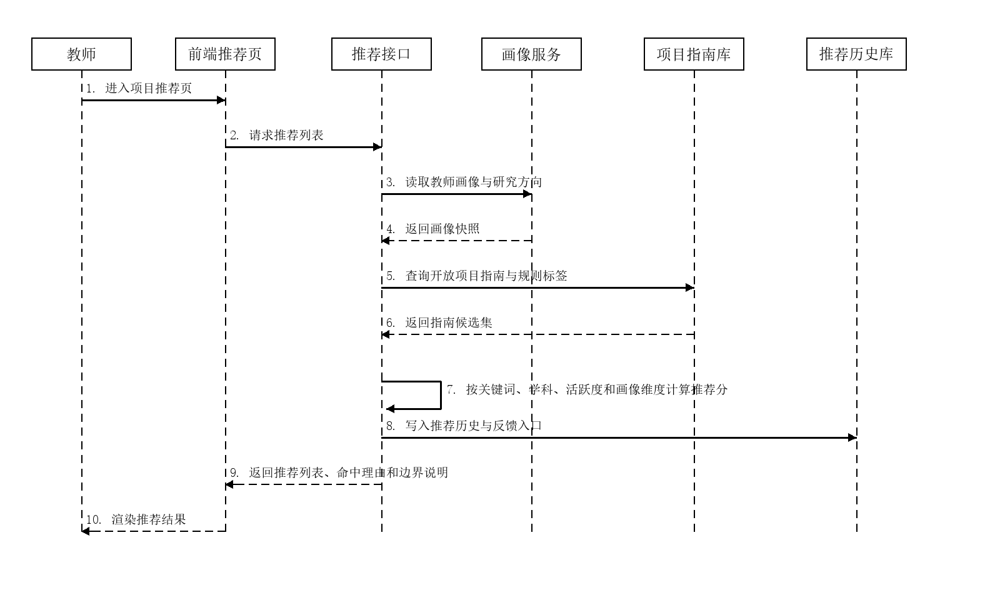

图 5.6 项目推荐时序图

图 5.6 从交互时序角度说明教师访问项目推荐页面时的主要调用过程。前端首先向推荐接口发起请求，后端读取教师画像、研究方向和开放项目指南，再根据关键词、学科、活跃度、申报窗口和画像维度计算推荐分，并写入推荐历史与反馈入口，最后将推荐列表、命中理由和解释说明返回前端。该图体现了推荐功能并非单纯页面展示，而是由前端、接口服务、画像服务、项目指南库和推荐历史库共同完成的业务链路。

对于智能问答功能，系统围绕教师资料、成果聚合、推荐结果和学院统计构建内部知识片段，再通过关键词重叠方式检索相关证据；当前论文涉及的主接口为 `/api/ai-assistant/portrait-qa/`，其问题类型在后端被归并为画像总结、维度原因、成果摘要、画像数据治理、成果与画像联动、成果与推荐联动、图谱状态、指南概览、推荐原因和学院统计等类别。接口返回结果除了答案文本外，还会同步返回 `source_details`、`source_governance`、`boundary_notes` 和可回跳页面信息，用于说明答案来源、适用范围和页面依据。模型增强链路能够将证据组织为更自然的中文回答，规则化回答机制则保证问答功能持续稳定可用；系统还提供 `/api/ai-assistant/dify-chat/` 扩展链路，以支持更灵活的模型服务接入。通过这种方式，系统在引入智能辅助能力的同时保持了结果清晰、来源可验证和页面可回跳。该实现借鉴了问答系统、稠密检索和检索增强生成研究对“证据组织—答案生成”链路的启发，并在高校科研管理场景中完成了工程化落地[17-20]。

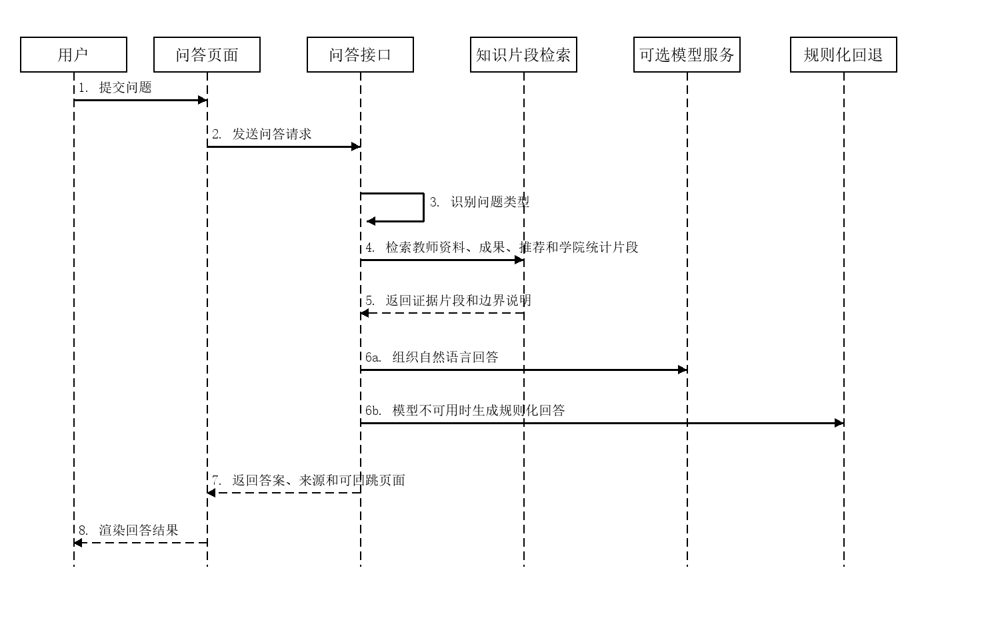

图 5.7 智能问答时序图

图 5.7 描述用户在系统内发起问答请求后的主要调用顺序。前端将问题提交给问答接口后，后端先识别问题类型，再检索教师资料、成果统计、推荐结果和学院统计等知识片段，并组织来源说明与适用范围提示；模型服务负责对证据片段进行自然语言组织，规则化回答机制负责提供稳定的基础回答能力。最终结果返回给前端时同时包含答案文本、来源信息和可回跳页面，从而保证问答结果能够被真实业务页面核验。

问答模块定位为“系统内导航式解释与辅助问答”。系统的知识来源覆盖教师资料、成果统计、推荐结果、学院统计和说明片段等内部结构化数据。对用户而言，该模块能够将分散在不同页面中的业务信息组织为自然语言说明，帮助教师和管理员更快理解画像结果、推荐依据和统计口径。

| 规则因素   | 主要来源                             | 作用说明                               |
|:-----------|:-------------------------------------|:---------------------------------------|
| 关键词匹配 | 研究方向、论文关键词、指南目标关键词 | 判断教师研究主题与指南是否直接相关     |
| 学科匹配   | 学科字段、院系信息、指南目标学科     | 判断教师所属方向与指南面向范围是否贴合 |
| 活跃度支撑 | 近三年成果数量                       | 判断教师当前是否具有较稳定的申报基础   |
| 申报窗口   | 截止日期                             | 判断当前是否处于适合准备申报的时间窗口 |
| 资助信息   | 指南资助强度字段                     | 提供对项目吸引力和优先级的辅助判断     |
| 画像联动   | 画像总分与优势维度                   | 将教师当前优势能力纳入推荐解释链路     |

表 5.5 推荐规则要素说明

| 片段来源     | 主要内容                         | 用途说明                           |
|:-------------|:---------------------------------|:-----------------------------------|
| 教师资料片段 | 院系、职称、学科、研究兴趣       | 支撑画像总结和基础信息问答         |
| 成果统计片段 | 论文、项目、知识产权等汇总指标   | 支撑成果概览和画像依据说明         |
| 推荐结果片段 | 推荐分、推荐理由、反馈信号       | 支撑为什么推荐某项目的解释         |
| 学院统计片段 | 教师数、成果总量、排行与趋势     | 支撑管理员视角的统计问答           |
| 来源说明片段 | 来源状态、覆盖范围、可验证页面 | 保证问答过程中的来源清晰与可核验性 |

表 5.6 问答模块知识片段来源说明

| 问题类型示例 | 主要用途 | 主要响应依据 |
|:--|:--|:--|
| portrait_summary、portrait_dimension_reason | 解释教师画像总体结果与维度原因 | 画像维度、权重说明、阶段对比结果 |
| achievement_summary、portrait_data_governance | 解释成果统计与画像数据口径 | 审核通过成果、认领状态、快照口径 |
| achievement_recommendation_link、guide_reason | 解释项目推荐命中原因 | 推荐分值、规则命中、支撑记录 |
| graph_status、academy_summary | 解释图谱状态与学院统计问题 | 图谱来源状态、学院级聚合统计 |

表 5.7 问答问题类型与响应依据

## 宏观决策看板与关系挖掘实现

学院级科研看板面向管理员提供宏观统计分析能力。系统通过对教师总数、论文数量、成果总量、合作关系数量、项目与知识产权分布等指标进行实时聚合，形成总览卡片、年度趋势图、院系分布图、教师排行和钻取分析结果。看板统计默认以审核通过成果为口径，支持学院管理员在本院范围内查看统计结果，也支持系统管理员进行更大范围的学院对比。管理员既可以查看整体态势，也可以下钻到指定院系或指定教师，从而形成由宏观到微观的分析路径；此外，系统还实现了 CSV 导出能力，便于答辩演示和管理复核。

在实现方式上，学院看板围绕“总览—对比—钻取—教师分析”四类视图展开。总览视图负责展示当前学院的教师规模与成果总量；对比视图负责比较不同院系或不同时间范围内的统计差异；钻取视图负责追溯某一统计结果背后的具体教师或成果条目；教师分析视图则支持管理员回到教师级别观察其画像、推荐与成果基础。该设计使学院看板形成面向科研管理场景的综合分析工作台，能够同时支撑宏观观察、结构比较和教师明细追踪。

学术图谱模块主要围绕教师、论文、关键词、合作学者和其他科研成果之间的关系进行展示。系统以 Neo4j 图谱数据和 MySQL 关系数据共同支撑关系网络表达，提供合作网络概览、基于阈值划分的合作圈层、合作者类型统计、主题热点分析和重点提示卡片等能力。该模块能够帮助教师和管理员从关系视角理解科研合作结构，与学术信息服务和知识图谱研究中强调的“关系组织优先于复杂推理”的落地路径较为一致[11-12]。

这种“Neo4j 图谱增强 + MySQL 主链路保障”的工程设计具有两层意义：一方面，Neo4j 能够提升关系展示与节点连接的表达能力；另一方面，MySQL 主业务数据能够保证教师画像、推荐和看板等核心功能持续稳定运行。该设计体现了系统对功能完整性、数据一致性和演示可靠性的综合考虑。

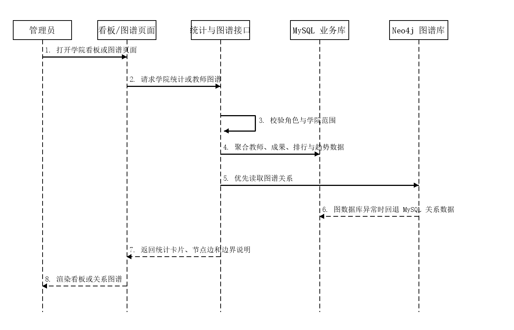

图 5.8 看板与图谱查询时序图

图 5.8 对学院看板和学术图谱的查询过程进行了时序化描述。管理员进入看板或图谱页面后，前端向统计与图谱接口发起请求；后端首先校验用户角色和学院范围，然后从 MySQL 聚合教师、成果、排行和趋势数据，并在图谱功能中优先读取 Neo4j 关系数据，同时利用 MySQL 主业务数据支撑节点边数据组织与来源说明。该图进一步说明看板与图谱模块具有独立的功能处理链路，而不是只依赖系统总体架构图进行概括。

| 功能域     | 主要输出                     | 实现特点                                |
|:-----------|:-----------------------------|:----------------------------------------|
| 学院总览   | 教师总数、成果总量、统计卡片 | 以审核通过成果为口径实时聚合            |
| 趋势与分布 | 年度趋势、院系分布、成果结构 | 支持按学院和年份切换观察范围            |
| 排行与钻取 | 教师排行、明细下钻、导出结果 | 支持管理员由宏观回到教师与成果明细      |
| 图谱展示   | 节点、边、关系说明           | Neo4j 图谱增强，MySQL 主链路保障稳定展示 |
| 关系分析   | 合作圈层、主题热点、类型统计 | 提供合作结构、主题分布和类型统计分析    |

表 5.8 宏观看板与图谱分析功能说明

表 5.8 说明学院看板与学术图谱并不是孤立存在的展示模块，而是分别服务于宏观统计观察与关系网络解释两个层面。通过将二者与教师画像和成果治理共享统一口径，系统能够以可维护的方式支撑学院级分析需求。

## 系统工程优化与安全保障

为了提高系统在开发、部署和演示过程中的稳定性，项目在工程层面引入了统一错误结构、请求编号机制、最小 CI 验证、演示数据恢复脚本和主链路回归验证脚本。后端通过 `RequestIdMiddleware` 与统一异常处理中间件收口错误返回；前端则通过路由守卫、登录态校验和会话恢复提示实现页面级权限控制，避免教师访问管理员页面或越权查看其他教师数据。

在异常治理方面，系统接口优先返回结构化错误信息，包括错误码、错误描述、可恢复性提示和请求编号。对推荐、图谱和问答等增强链路，系统也设计了相应的稳定保障逻辑，以保证核心业务页面持续可用。结合仓库中已有的启动前检查脚本 、演示数据恢复脚本 、主链路回归脚本 以及统一验证入口 ，项目已经形成较完整的开发自检、演示恢复与主链路回归机制。

此外，系统在账户侧还通过统一的 `role_code`、`role_label` 和 `permission_scope` 收拢角色权限，避免在多个模块中重复分散定义权限规则；在教师侧，会话级登录态能够满足日常使用与答辩演示需求；在管理员侧，则通过批量账户操作、密码重置、通知提醒和恢复脚本保障演示数据始终可回到稳定状态。上述措施体现出较完整的工程化意识与可维护性考虑。

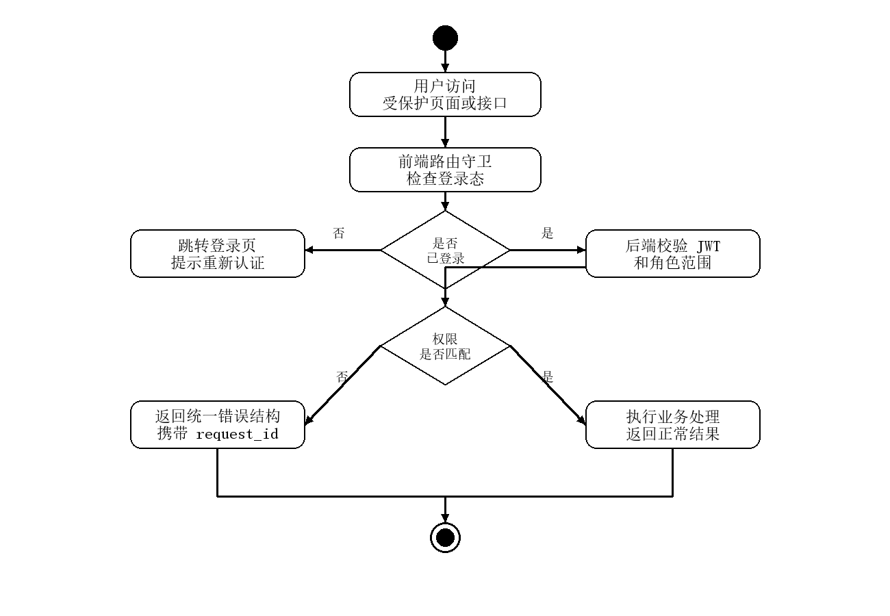

图 5.9 权限边界与异常处理活动图

图 5.9 描述用户访问受保护页面或接口时的权限判断过程。系统先由前端路由守卫检查登录态，未登录用户被引导回登录页面；已登录用户继续由后端校验 JWT、角色和学院范围。若权限匹配则执行业务处理并返回正常结果，若权限不足则返回统一错误结构和请求编号。该图与表 4.12 的统一错误结构相互对应，说明系统安全保障由前端路由控制和后端权限校验共同完成。

| 保障项   | 主要实现                           | 工程价值                               |
|:---------|:-----------------------------------|:---------------------------------------|
| 权限控制 | 路由守卫、JWT、角色范围校验        | 防止越权访问，保证教师与管理员边界清晰 |
| 异常治理 | 统一错误结构、请求编号、中间件收口 | 便于问题定位与前后端协同处理           |
| 稳定保障 | 图谱、问答、推荐的稳定保障机制     | 保证增强链路与主业务协同可用           |
| 演示恢复 | 恢复脚本、演示账号初始化           | 便于答辩前快速恢复标准演示环境         |
| 验证机制 | 启动前检查、回归脚本、统一流水线   | 降低功能回归风险，提升可维护性         |

表 5.9 系统工程优化与保障措施

表 5.9 进一步说明，系统工程优化并非附属内容，而是保证论文原型能够稳定运行的重要组成部分。对于本科毕业设计项目而言，权限收口、统一异常处理、演示恢复和验证脚本等措施，直接决定了系统的可维护性与可展示性。

综上，本章围绕数据治理、科研画像、智能辅助、宏观看板和工程保障五个方面，对系统核心实现过程进行了说明。由此可见，论文中的主要功能模块均已在当前仓库中形成对应实现，并且各模块之间具有较清晰的业务协同关系。

# 系统测试

## 测试环境说明

系统测试主要在本地开发环境中进行。前端使用 Node.js 与 Vite 运行开发服务，后端采用 Python、Django 和 MySQL 运行主业务逻辑，Neo4j 在需要时作为图谱增强组件接入。为保证测试环境一致性，项目提供了依赖清单、启动前检查脚本、演示数据恢复脚本和统一验证入口，用于在测试前完成环境准备。按照仓库中的真实验证顺序，系统通常先执行 `startup_preflight.py` 检查环境与迁移状态，再执行 `restore_demo_state.py` 恢复演示数据，随后运行 `manage.py check`、后端测试用例、前端基线验证以及主链路回归脚本。

本章测试的目标是验证系统主要功能是否稳定可用、权限控制是否正确、增强链路是否具备稳定保障能力，以及在演示数据规模下是否满足教师与管理员的使用需求。基于这一定位，测试方法以功能验证、权限验证、异常场景验证和性能观察为主。

| 测试项     | 环境说明                                               |
|:-----------|:-------------------------------------------------------|
| 操作系统   | Windows 开发环境                                       |
| 前端环境   | Node.js、Vite、Vue 3                                   |
| 后端环境   | Python、Django、Django REST Framework                  |
| 数据库环境 | MySQL，Neo4j 作为图谱增强组件                          |
| 演示数据   | 使用恢复脚本恢复的内置演示教师、成果与项目指南数据     |
| 测试方式   | 前端基线验证、后端接口检查、自动化测试、主链路回归测试 |

系统测试环境

| 步骤       | 说明                                                     |
|:-----------|:---------------------------------------------------------|
| 环境检查   | 运行 `startup_preflight.py` 确认依赖、迁移和基础环境可用 |
| 数据恢复   | 运行 `restore_demo_state.py` 恢复标准演示账号与基础数据  |
| 后端检查   | 执行 `manage.py check` 和模块测试用例                    |
| 前端验证   | 执行前端基线验证，确认登录态和主页面可访问               |
| 主链路回归 | 运行主链路回归脚本，验证关键业务闭环                     |

测试执行步骤说明

表 6.1 与表 6.2 说明了本章测试并不是零散操作的简单罗列，而是围绕统一环境、统一数据和统一验证顺序展开。通过先恢复标准演示状态、再执行环境检查和主链路验证，可以有效降低环境差异对测试结果的干扰。

为避免测试章节停留在纯定性描述层面，本文于 2026 年 4 月 14 日在恢复演示数据后，按统一顺序执行了启动前检查、数据恢复、Django 静态检查、后端自动化测试、前端基线验证、主链路回归验证和汇总验证流水线。真实执行结果如表 6.3 所示，其中后端自动化测试共执行 151 项用例并全部通过，可为教师端、管理员端以及增强链路的主要功能闭环提供更直接的验证证据。

| 命令或脚本 | 真实结果 |
|:--|:--|
| python backend/scripts/startup_preflight.py | 启动前检查通过，环境与关键依赖可用 |
| python backend/scripts/restore_demo_state.py | 演示数据恢复通过，可回到标准演示状态 |
| python backend/manage.py check | 系统静态检查通过，未发现配置级错误 |
| python backend/manage.py test --keepdb --noinput users achievements graph_engine project_guides ai_assistant | 共执行 151 项后端自动化测试，全部通过，用时 727.998 s |
| npm run verify:baseline | 前端基线验证通过 |
| python backend/scripts/verify_development_16_24_regression.py | 主链路回归验证通过 |
| python backend/scripts/run_validation_pipeline.py | 汇总验证流水线通过，关键验证环节全部成功 |

关键验证脚本执行结果

## 系统功能测试

功能测试重点围绕教师端和管理员端的主链路展开，包括登录认证、个人资料维护、成果录入与审核、科研画像查看、项目推荐查看、智能问答使用、学院看板访问和学术图谱查看等内容。结合仓库中 `users`、`achievements`、`graph_engine`、`project_guides` 和 `ai_assistant` 等模块的自动化测试，以及 `verify_development_16_24_regression.py` 提供的接口级主链路回归，系统能够较完整地支撑教师科研数据治理与辅助分析的主要业务流程。

除基本功能外，本文还关注权限控制和异常稳定性的正确性。这是因为系统不仅有教师用户，还包含学院管理员和系统管理员两个管理角色；同时，图谱和问答等增强能力与主业务链路形成协同，其异常处理是否稳定直接影响系统的可提交性和演示可靠性。测试用例设计遵循“覆盖主链路、覆盖高风险场景、覆盖异常路径”的思路。

| 编号 | 功能模块 | 测试内容                   | 预期结果                                             |
|:-----|:---------|:---------------------------|:-----------------------------------------------------|
| T1   | 登录认证 | 使用有效工号与密码登录     | 成功进入系统主页，未登录访问受保护接口返回 401       |
| T2   | 个人中心 | 修改个人资料并保存         | 页面提示成功，信息更新生效，可返回最新资料与权限范围 |
| T3   | 成果管理 | 新增论文成果记录并提交审核 | 成果保存成功并进入列表，状态为待审核                 |
| T4   | 成果认领 | 向校内合著者发送认领邀请   | 生成认领记录并向目标教师写入通知                     |
| T5   | 成果审核 | 管理员审核待处理成果       | 成果可被通过或驳回，并影响后续统计口径               |
| T6   | 科研画像 | 查看教师画像结果           | 显示雷达图、趋势、权重说明和维度解释                 |
| T7   | 项目推荐 | 查看推荐列表与推荐理由     | 成功返回推荐结果、教师快照与解释信息                 |
| T8   | 智能问答 | 发起系统内问题咨询         | 返回带来源说明与适用范围提示的回答结果               |
| T9   | 学院看板 | 查看学院统计总览           | 成功显示统计卡片、趋势图和排行结果                   |
| T10  | 学术图谱 | 查看教师学术图谱           | 成功展示关系网络，并具备稳定保障结果                 |

系统功能测试用例示例

| 编号 | 测试场景                       | 预期结果                         | 是否通过 |
|:-----|:-------------------------------|:---------------------------------|:---------|
| P1   | 未登录访问当前用户接口         | 返回 401，禁止访问               | 是       |
| P2   | 教师访问管理员页面             | 前端路由守卫拦截，后端接口拒绝   | 是       |
| P3   | 教师访问其他教师画像或图谱     | 返回 403，仅允许本人或管理员访问 | 是       |
| P4   | 学院管理员查看外院教师管理数据 | 返回受限结果或禁止访问           | 是       |
| P5   | 系统管理员查看全校范围统计     | 成功返回全校对比数据             | 是       |

权限控制测试示例

| 编号 | 异常场景             | 预期结果                               | 是否通过 |
|:-----|:---------------------|:---------------------------------------|:---------|
| E1   | Neo4j 不可用         | 图谱接口返回 MySQL 稳定展示结果或来源说明 | 是       |
| E2   | 问答模型不可用       | 返回规则化安全回答，不影响页面使用     | 是       |
| E3   | 暂无开放项目指南     | 推荐模块返回空状态和解释提示           | 是       |
| E4   | 参数错误或对象不存在 | 返回统一错误结构、请求编号和下一步建议 | 是       |
| E5   | 演示数据被破坏       | 恢复脚本执行后可回到标准演示状态       | 是       |

异常场景与稳定性验证示例

表 6.4、表 6.5 和表 6.6 分别从主功能、权限控制和异常稳定性三个角度验证了系统的可用性。测试结果表明，系统不仅能够支撑教师与管理员的核心业务流程，也能够在越权访问、增强链路异常和演示环境损坏等场景下维持稳定运行。

## 系统性能与并发测试

结合本科毕业设计项目的运行目标，性能测试主要关注系统在演示数据规模下的响应稳定性和页面可用性。测试表明，在常规使用条件下，成果录入、画像分析、推荐查看和学院统计功能均能够在可接受时间内完成响应；Neo4j 图谱增强和智能辅助链路也通过稳定保障机制保持核心功能可用。结合统一验证入口的实际执行结果可以看出，系统主链路运行稳定、错误可定位、演示环境可恢复。

从测试结果看，教师端和管理端主要页面能够稳定访问，核心接口能够在较短时间内完成响应，增强链路的稳定保障机制能够保证主业务连续可用。这说明系统已经具备良好的演示稳定性和工程可验证性。

在此基础上，本文进一步使用本地生成脚本对关键接口进行了单次耗时测量，测量方式基于恢复后的演示数据和 Django 测试客户端，能够反映系统在本地开发环境中的接口响应级别。表 6.7 给出了主要接口与权限场景的测量结果。

| 接口名称 | 路径 | 状态码 | 耗时/ms |
|:--|:--|--:|--:|
| 教师资料接口 | /api/users/me/ | 200 | 125.57 |
| 画像总览接口 | /api/achievements/dashboard-stats/ | 200 | 242.62 |
| 画像雷达接口 | /api/achievements/radar/100001/ | 200 | 20.39 |
| 项目推荐接口 | /api/project-guides/recommendations/ | 200 | 134.02 |
| 画像问答接口 | /api/ai-assistant/portrait-qa/ | 200 | 164.67 |
| 学术图谱接口 | /api/graph/topology/100001/ | 200 | 30.85 |
| 学院看板接口 | /api/achievements/academy-overview/ | 200 | 80.05 |
| 未登录访问用户资料 | /api/users/me/ | 401 | 2.43 |
| 教师越权访问看板 | /api/achievements/academy-overview/ | 403 | 0.91 |

关键接口响应时间测量结果

表 6.7 说明，在测试数据规模下，画像总览、项目推荐、画像问答和学院统计等核心接口均能够在可接受时间内返回结构化结果；而权限拒绝类接口则能快速给出 401 或 403 响应，有助于维持主链路的稳定性与权限清晰性。

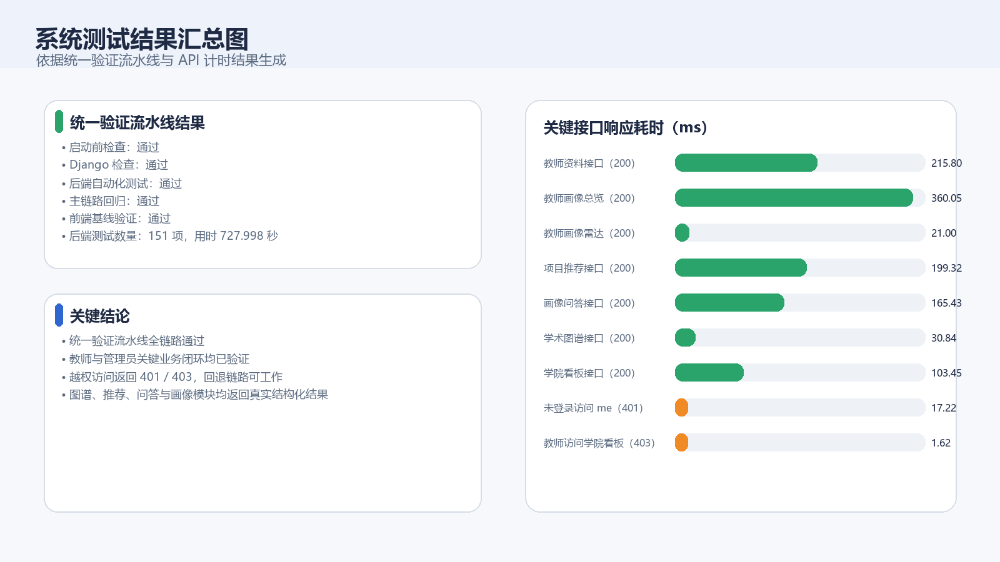

综上，本章测试结果表明，系统在测试环境和演示数据规模下已经具备较好的稳定性、可恢复性和可验证性。对于本科毕业设计系统而言，现有测试能够有效支撑系统功能完整性与工程可用性的结论。

# 总结与展望

## 全文总结

本文围绕高校教师科研能力数字画像与智能辅助场景，完成了一套可运行系统的分析、设计、实现与测试工作。系统以科研成果治理为主数据入口，以多维科研画像为核心分析能力，并进一步扩展了学术图谱、项目推荐、智能问答和学院科研看板等功能。实践表明，基于可解释、可验证、工程可落地的设计思路，可以构建较完整的高校教师科研分析与辅助系统。

从论文主线来看，本文完整经历了需求分析、总体设计、模块实现与系统测试四个阶段，并且使论文内容与仓库中的实际实现保持了一致性。对于本科毕业设计而言，这种以真实业务流程、真实工程结构和真实测试验证为基础的系统建设路径，充分体现了项目的综合实践价值。

## 应用推广与优化方向

在已完成功能基础上，系统还具备良好的应用推广和持续优化空间：其一，可结合更多年度数据增强画像快照与跨年度对比能力；其二，可在现有问答链路基础上扩展更多系统内知识片段，提高知识辅助覆盖范围；其三，可结合更丰富的院系业务数据优化推荐规则与反馈闭环；其四，可探索学院看板的离线聚合与缓存机制，以提升更大数据规模下的响应效率。相关方向与大语言模型辅助应用、知识图谱扩展和智能可视分析的发展趋势具有一致性，也体现出本文系统良好的扩展潜力[9,20,22]。

总体而言，本文完成的系统已经形成面向高校科研管理场景的完整业务主链路，具备清晰的数据组织结构、稳定的工程实现和明确的扩展方向。系统能够支撑教师成果治理、科研画像、项目推荐、智能问答、学术图谱和学院看板等核心功能，体现出较好的应用价值和推广潜力。

# 致谢

在本次毕业设计与论文撰写过程中，我在系统需求分析、项目实现、论文整理和答辩准备等方面得到了老师与同学们的帮助与支持。在此谨向所有给予指导和帮助的师长、同学与家人表示诚挚感谢。

# 关键接口与验证命令摘要

附录用于补充论文正文中不适合展开过细、但在答辩和归档过程中具有参考价值的接口与验证信息。下列内容均来自当前仓库中的最终版系统实现与本地验证结果。

| 功能域 | 典型接口 | 主要用途 |
|:--|:--|:--|
| 认证与账户 | /api/token/; /api/users/me/ | 登录认证、当前用户信息获取与安全信息维护 |
| 成果治理 | /api/achievements/papers/; /api/claims/ | 成果录入、审核、认领与统计 |
| 画像分析 | /api/achievements/dashboard-stats/; /api/achievements/radar/{user_id}/ | 返回画像总览、维度雷达与解释数据 |
| 推荐辅助 | /api/project-guides/recommendations/ | 返回推荐结果、命中理由、支撑记录与反馈信息 |
| 智能问答 | /api/ai-assistant/portrait-qa/; /api/ai-assistant/dify-chat/ | 返回可信式问答结果及模型扩展结果 |
| 图谱与看板 | /api/graph/topology/{user_id}/; /api/achievements/academy-overview/ | 返回学术图谱与学院科研统计结果 |

关键业务接口摘要

| 命令或脚本 | 主要作用 |
|:--|:--|
| python backend/scripts/startup_preflight.py | 启动前环境检查与关键依赖核验 |
| python backend/scripts/restore_demo_state.py | 恢复标准演示数据与演示账号状态 |
| python backend/manage.py check | Django 项目静态检查 |
| python backend/manage.py test --keepdb --noinput users achievements graph_engine project_guides ai_assistant | 后端自动化测试执行 |
| python backend/scripts/verify_development_16_24_regression.py | 关键主链路回归验证 |
| npm run verify:baseline | 前端基线行为验证 |
| python backend/scripts/run_validation_pipeline.py | 汇总验证流水线执行 |

关键验证命令摘要

# 参考文献：

[1] 祝智庭, 胡姣. 教育数字化转型: 面向未来的教育"转基因"工程 [J]. 开放教育研究, 2022, 28 (5): 12-19.

[2] 教育部, 科技部. 关于规范高等学校 SCI 论文相关指标使用 树立正确评价导向的若干意见 [Z]. 2020.

[3] 王杨, 余敏槠, 单桂华, 等. 学者学术状态及竞争力可视化系统 [J]. 计算机系统应用, 2020, 29 (8): 48-57.

[4] Balog K, Azzopardi L, de Rijke M. Formal Models for Expert Finding in Enterprise Corpora [C]//Proceedings of the 29th Annual International ACM SIGIR Conference on Research and Development in Information Retrieval. 2006.

[5] Husain O, Salim N, Alias R A, et al. Expert Finding Systems: A Systematic Review [J]. Applied Sciences, 2019, 9 (20): 4250.

[6] Hirsch J E. An Index to Quantify an Individual's Scientific Research Output [J]. Proceedings of the National Academy of Sciences, 2005, 102 (46): 16569-16572.

[7] Abramo G, D'Angelo C A. How Do You Define and Measure Research Productivity? [J]. Scientometrics, 2014, 101 (2): 1129-1144.

[8] Siudem G, Zogala-Siudem B, Cena A, et al. Three Dimensions of Scientific Impact [J]. Proceedings of the National Academy of Sciences, 2020, 117 (25): 13896-13900.

[9] Ji S, Pan S, Cambria E, et al. A Survey on Knowledge Graphs: Representation, Acquisition and Applications [J]. IEEE Transactions on Neural Networks and Learning Systems, 2021.

[10] 黄恒琪, 于娟, 廖晓, 等. 知识图谱研究综述 [J]. 计算机系统应用, 2019, 28 (6): 1-12.

[11] 张吉祥, 张祥森, 武长旭, 等. 知识图谱构建技术综述 [J]. 计算机工程, 2022, 48 (3): 23-37.

[12] 汤庸, 陈国华, 贺超波, 等. 知识图谱及其在学术信息服务领域的应用 [J]. 华南师范大学学报(自然科学版), 2018, 50 (5): 110-119.

[13] Tang J, Zhang J, Yao L, et al. ArnetMiner: Extraction and Mining of Academic Social Networks [C]//Proceedings of the 14th ACM SIGKDD International Conference on Knowledge Discovery and Data Mining. 2008: 990-998.

[14] Adomavicius G, Tuzhilin A. Toward the Next Generation of Recommender Systems: A Survey of the State-of-the-Art and Possible Extensions [J]. IEEE Transactions on Knowledge and Data Engineering, 2005, 17 (6): 734-749.

[15] 于蒙, 何文涛, 周绪川, 等. 推荐系统综述 [J]. 计算机应用, 2022, 42 (6): 1898-1913.

[16] Lü L, Medo M, Yeung C H, et al. Recommender Systems [J]. Physics Reports, 2012, 519 (1): 1-49.

[17] 闫悦, 郭晓然, 王铁君, 等. 问答系统研究综述 [J]. 计算机系统应用, 2023, 32 (8): 1-18.

[18] Karpukhin V, Oguz B, Min S, et al. Dense Passage Retrieval for Open-Domain Question Answering [C]//Proceedings of the 2020 Conference on Empirical Methods in Natural Language Processing (EMNLP). 2020: 6769-6781.

[19] Lewis P, Perez E, Piktus A, et al. Retrieval-Augmented Generation for Knowledge-Intensive NLP Tasks [J]. Advances in Neural Information Processing Systems, 2020, 33: 9459-9474.

[20] Zhao W X, Zhou K, Li J, et al. A Survey of Large Language Models [J]. arXiv preprint arXiv:2303.18223, 2023.

[21] Keim D, Andrienko G, Fekete J D, et al. Visual Analytics: Definition, Process, and Challenges [M]//Information Visualization. Springer, 2008: 154-175.

[22] 骆昱宇, 秦雪迪, 谢宇鹏, 等. 智能数据可视分析技术综述 [J]. 软件学报, 2024, 35 (1): 356-404.
